# Laboratory 1 - Deep Neural Networks: MLPs, ResMLPs, and CNNs

## Overview
This laboratory explores deep neural network architectures and their training dynamics, focusing on MLPs, Residual MLPs (ResMLPs), and CNNs trained on standard image classification datasets (MNIST, CIFAR-10, CIFAR-100). 

All experiments are tracked with Weights & Biases. You can find the complete logs and results here: [Lab_1 Results](https://wandb.ai/chiara-peppicelli-university-of-florence/DLA_Lab_1?nw=nwuserchiarapeppicelli).  

Main Objectives:

- Reproducing, on a smaller scale, the findings of: [*Deep Residual Learning for Image Recognition*](https://arxiv.org/abs/1512.03385).
- Understanding the effect of residual connections on model performance.
- Investigating training dynamics and gradient flow.
- Exploring transfer learning through fine-tuning techniques.

### Project Structure

```
Lab_1/
├── main_ex1.py          # Main script for Exercise 1 (MLP/CNN experiments).
├── main_ex2.py          # Main script for Exercise 2 (Fine-tuning experiments).
├── models.py            # Model implementations (MLP, ResMLP, CNN).
├── dataloaders.py       # Data loading utilities for MNIST, CIFAR-10, CIFAR-100.
├── train_eval.py        # Training and evaluation functions.
├── utils.py             # Utility functions (gradient analysis, feature extraction).
├── run_experiments.sh   # Script to run all experiments.
├── images/              # Folder containing figures/plots/results.
└── README.md            # This file.
```

### Implemented Models
1. **MLP (Multilayer Perceptron)**
  - Configurable depth and width.
  - Optional batch normalization.
  - Standard feedforward architecture.
2. **ResMLP (Residual MLP)**
  - MLP with residual connections between blocks.
  - Each block contains two linear layers with skip connections.
  - Configurable depth and width.
  - Demonstrates residual learning benefits on MLPs.
3. **CNN (Convolutional Neural Network)**
  - ResNet-style architecture with BasicBlocks.
  - Configurable layer patterns: e.g. [2,2,2,2], [3,4,6,3], [5,6,8,5].
  - Optional residual connections for comparison.
  - Suitable for feature extraction and transfer learning.

#### Datasets
- **MNIST**: 28×28 grayscale digit (10 classes).
- **CIFAR-10**: 32×32 color image (10 classes).
- **CIFAR-100**: 32×32 color image (100 classes).

### Requirements
All core dependencies are already listed in the main repository’s `requirements.txt`.

Alternatively, it's possible to install them manually: 
```bash 
pip install torch torchvision tqdm matplotlib scikit-learn wandb numpy
```
(Optional but recommended) Log in to Weights & Biases:
```bash
wandb login
```

**Running Experiments**:
It's possible to run all the experiments with the provided script:
```bash
chmod +x run_experiments.sh
./run_experiments.sh
```

## Exercise 1: Verification of ResNet findings on MLPs and CNNs
Train and evaluate MLPs and CNNs on MNIST/CIFAR-10 with varying depth, width, normalization, residual connections, and learning rate schedulers.

Run via command line using `main_ex1.py`.

#### Common Arguments:
- `--epochs`: Number of training epochs (default: `50` for MLPs, `75` for CNNs).
- `--batch_size`: Batch size (default: `128`).
- `--lr`: Learning rate (default: `0.001`).
- `--num_workers`: Data loading workers (default: `4`).
- `--use_wandb`: Enable Weights & Biases logging.
- `--use_scheduler`: Use cosine annealing scheduler.

## MLP
Some examples on how to train and test the MLP/ResMLP models:

```bash
# Standard MLP on MNIST
python main_ex1.py --model mlp --dataset MNIST --depth 10 --width 128 --epochs 50

# ResMLP with residual connections
python main_ex1.py --model resmlp --dataset MNIST --depth 10 --width 128 --epochs 50

# With batch normalization and scheduler
python main_ex1.py --model resmlp --dataset MNIST --depth 20 --width 128 --normalization --use_scheduler --epochs 50
```
In addition to the common arguments presented above, the arguments specific to MLP and ResMLP are:

#### MLP/ResMLP Specific Arguments:
- `--model`: Choose 'mlp' or 'resmlp'.
- `--hidden_size`: Only for 'mlp', provide a custom list of layer sizes.
- `--depth`: Number of hidden layers.
- `--width`: Number of neurons per layer
- `--normalization`: Enable batch normalization.

When using the MLP model (as opposed to ResMLP), there are two main ways to define its architecture:

- Custom architecture with `--hidden_sizes`: A list of integers can be provided to specify the size of each hidden layer. This allows experimentation with arbitrary layer configurations.

- Standard architecture with `--width` and `--depth`: This configuration enables a direct comparison with ResMLP, ensuring that both models have a comparable number of layers and units.

### Results MLP vs ResMLP on MNIST 
The first set of experiments involved applying MLP and ResMLP architectures to the MNIST dataset. I tested models with different depths (`10`, `20`, `40`) and widths (`32`, `64`, `128`), considering both the presence or absence of normalization and the use of a learning rate scheduler. This allowed me to evaluate the effect of residual connections and architectural configurations on training stability and performance.

**Key observations:** 
1. **Depth without residual = total instability**: All MLPs without residual at `depth=40` collapse to ~0.11 test accuracy. Even with normalization (n1), some attempt to converge but remain very low (e.g., mlp `width=128`, `depth=40`, `normalization`, `scheduler` ~0.41 acc).

→ Direct confirmation of the ResNet thesis: deeper ≠ better accuracy; in fact, clear degradation without skip connections (reference figure 3 below).

2. **Residual connections enable deeper architectures**: All resMLPs at depth=40 converge very well, for example `resmlp_w64_d40_n1_sched1` = 98.35% test acc vs `mlp_w64_d40_n1_sched1` = 88.7%.

→ Residuals keep training stable even in very deep architectures, unlike plain MLPs.

|1. Train Loss of all MLPs at `depth=40` (varying hyperparameters)| 2.ResMLP vs MLP Train Loss at `depth=40` (both use `scheduler + normalization`)   |
|--------------------------------------------|--------------------------------------------------------|
|  |  |

|3. Validation Accuracy of all MLPs (different architecture but `scheduler + normalization`)|4. ResMLP vs MLP Validation Accuracy at `depth=40` (both use `scheduler + normalization`) |
|--------------------------------------------|--------------------------------------------------------|
| 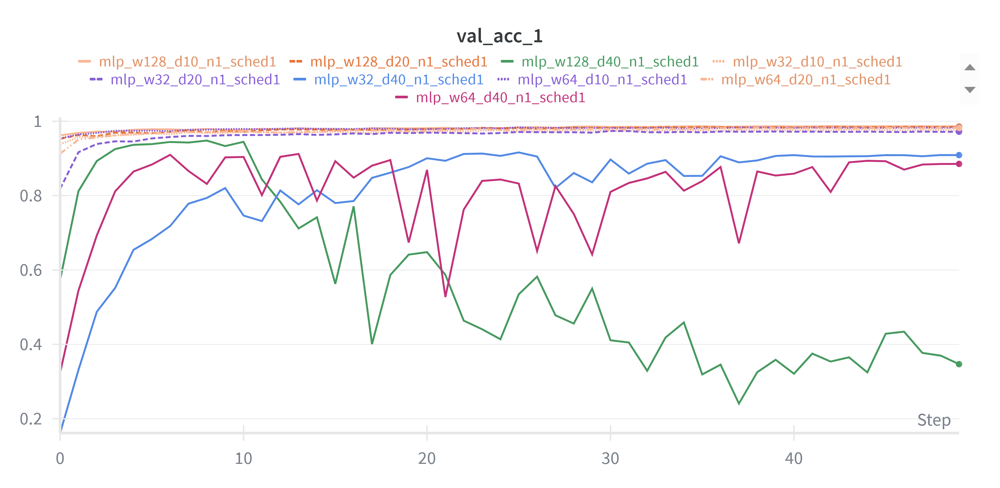 |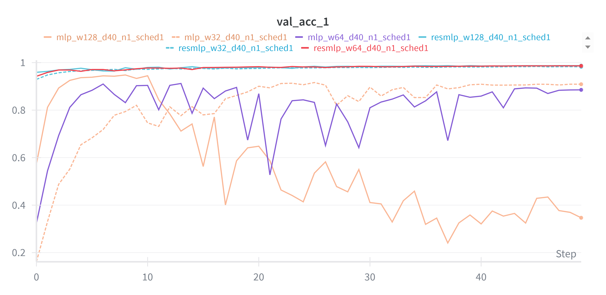 |


3. **Effect of width (w=32 → 64 → 128)**: At equal depth and with residual, increasing width gives small gains, for examples at depth 10 the test accuracy went from `97.77%` (`resmlp_w32_d10_n1_sched1`) to `98.59%` (`resmlp_w128_d10_n1_sched1`).

4. **Normalization is always useful**: For example
- Without norm `mlp_w32_d20_n0_sched1`=`95.69%` accuracy.
- With norm `mlp_w32_d20_n1_sched1`=97.41% accuracy.
Residual + norm always pushes to the top (>98.5%).

→ Normalization mitigates instability, but alone is not enough for very deep nets (without residual they still collapse).

| Train Loss of MLP models with and without **normalization** (`depth=20`, scheduler, various width)|Validation Accuracy of MLP models with and without **normalization** (`depth=20`, scheduler, various width)   |
|--------------------------------------------|---------------|
|  | 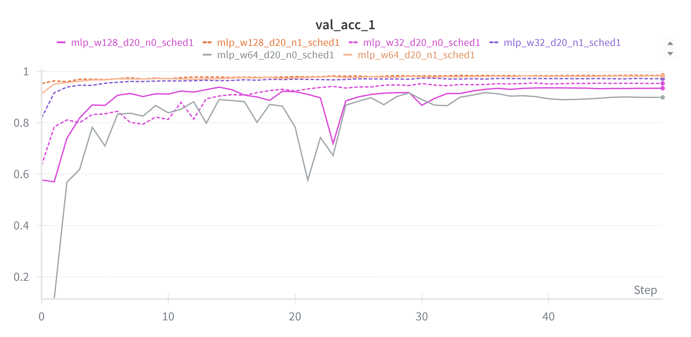 | 

To better understand why residual connections improve training, I also analyzed the gradient flow in deep models.
I computed the gradient norms of each layer for a single minibatch.
In the plain 40-layer MLP, the gradient magnitudes vanish in the earliest layers, making training unstable and preventing learning.
In contrast, the residual MLP of the same depth shows stable gradient norms across layers, confirming that skip connections alleviate vanishing gradients and allow effective training of deep networks.

I ran MLP and ResMLP on MNIST with `depth=40` and `width=64` (no scheduler, no normalization). The table below shows the gradient norms:

| Gradient norm, model MLP | Gradient norm, model ResMLP| 
|--------------------------------------------|------------------------------------|
|   |   | 
| test accuracy 11.35% | test accuracy 96.65% | 


## CNN 
The CNN model is implemented using the BasicBlock definition from torchvision in [torchvision](https://github.com/pytorch/vision/blob/main/torchvision/models/resnet.py#L59).

Training can be performed with different configurations as shown below:

```bash
# CNN with residual connections (ResNet-18 style layers [2 2 2 2])
python main_ex1.py --model cnn --dataset CIFAR10 --layers 2 2 2 2 --use_residual --epochs 75

# CNN without residual connections
python main_ex1.py --model cnn --dataset CIFAR10 --layers 2 2 2 2 --epochs 75

# Deeper CNN (ResNet-34 style)
python main_ex1.py --model cnn --dataset CIFAR10 --layers 3 4 6 3 --use_residual --use_scheduler --epochs 75
```
In addition to the common arguments listed above, the CNN-specific arguments are:

#### CNN Specific Arguments:
- `--model`: Must be set to 'cnn'.
- `--layers`: Layer pattern (e.g. 2 2 2 2 for ResNet-18).
- `--use_residual`: Enable residual (skip) connections.

### Results CNN vs ResNet on CIFAR10
The second set of experiments focused on applying CNNs to the **CIFAR-10** dataset. I experimented with ResNet-style models of varying depths (ResNet-18, ResNet-34, and a deeper ResNet-50-like network (only in configuration, without adding bottleneck blocks)), with and without residual connections, and with or without a learning rate scheduler. These experiments provided insights into how architectural depth and skip connections influence model performance.

**Key observations:**

1. **With vs without skip connections**:
  - Without skip: Deep models collapse: `cnn_skip0_L5-6-8-5_sched0 = 41% acc`, sched1 even worse = 27% acc. Medium architecture (L3-4-6-3) improves slightly but remains low (59–70%). Only the smallest one (L2-2-2-2) reaches ~74–76%.
  - With skip: All models surpass **75–78%** accuracy. For examples `cnn_skip1_L3-4-6-3_sched1 = 77.9%` and `cnn_skip1_L2-2-2-2_sched1 = 77.9%`. Even the deepest model (L5-6-8-5), which collapsed without skip, reaches **77.8%** with skip.

-> For CNNs as well, residual connections stabilize training and enable deeper networks.

Table of accuracy (note all models use scheduler):
| Models                    | Architecture (L) | Test Accuracy |
| ------------------------- | ---------------- | ------------- |
| CNN                       | 2-2-2-2          | 0.7658        |
| CNN                       | 3-4-6-3          | 0.7069        |
| CNN                       | 5-6-8-5          | *0.2747*      |
| CNN with skip connections | 2-2-2-2          | 0.7795        |
| CNN with skip connections | 3-4-6-3          | **0.7788**    |
| CNN with skip connections | 5-6-8-5          | 0.7780        |


| Train Loss curve of the models above| Validation accuracy of the models above|
|---------------------------|-----------|
| 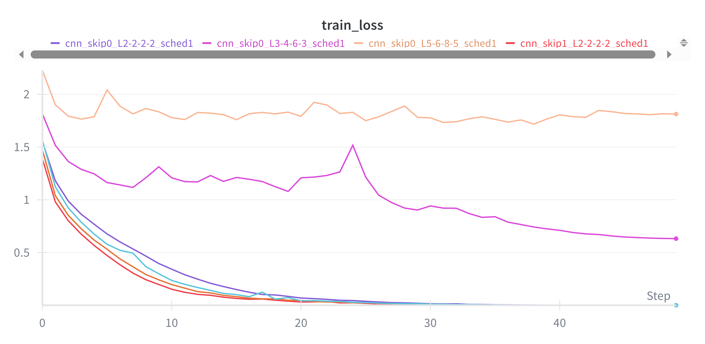 |  |


2. **Effect of data augmentation (augm vs non-augm)**: I had good results, but I decided to introduce some data augmentations on the CIFAR10 dataset (all experiments without `_augm_` were run without augmentations). In particular I applied **random cropping** (`transforms.RandomCrop(32, padding=4)`) and **random horizontal flipping** (`transforms.RandomHorizontalFlip`). I found that these augmentations significantly improved the accuracy!
The three experiments with augmentations and skip connection achieve the higher test accuracy (**~85%**):
  - `cnn_augm_skip1_L5-6-8-5_sched1 = 85.3%`.
  - `cnn_augm_skip1_L3-4-6-3_sched1 = 85.4%`.
  - `cnn_augm_skip1_L2-2-2-2_sched1 = 85.0%`.
All clearly outperform models without augmentation (max ~78%).

-> Data augmentation provides a substantial boost in performance!

Additionally, as observed in the loss curves below, augmentation not only improves accuracy but also reduces overfitting: training loss remains slightly higher compared to non-augmented models, while validation loss stays lower and more stable.

|Training Loss Comparison with and without augmentation | Validation Loss Comparison| 
|--------------------------------------------|------------------------------------|
| 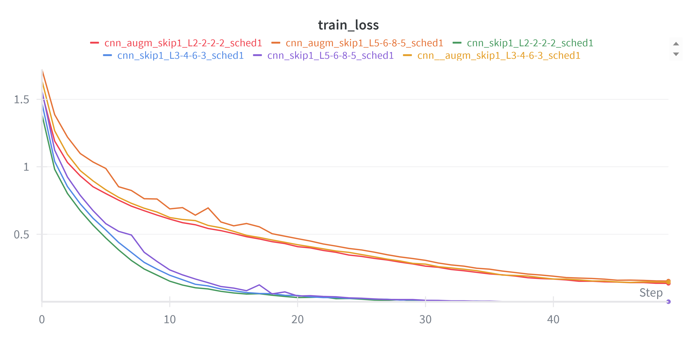  | 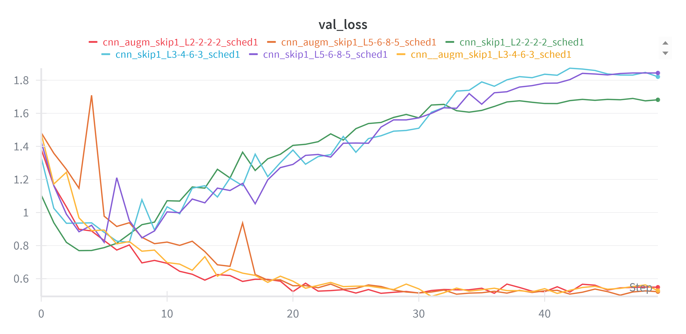  | 

Accuracy comparison for models with and without augmentation. Models with augmentation consistently achieve higher validation accuracy: 

| Validation Accuracy| 
|------------------------|
| 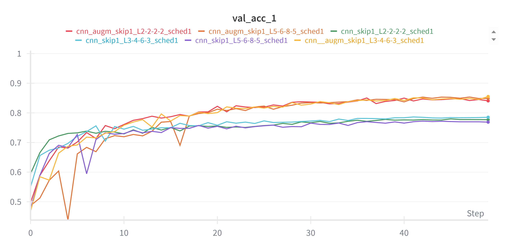  |


## Exercise 2: Pre-trained model fine-tuning from CIFAR-10 to CIFAR-100
For the second exercise, I decided to perform fine-tuning on CIFAR100. I chose to fine-tune one of the best-performing models on CIFAR10, specifically the smaller CNN ResNet-18 style model ([2,2,2,2]). This model was trained using data augmentation, skip connections, and a learning rate scheduler, since all models with this configuration achieved similar (and the best) top accuracies, I opted for the simpler architecture.

Examples of how fine-tuning can be performed:
```bash
# Linear evaluation (freeze all layers)
python main_ex2.py --path Models/your_pretrained_model.pth --freeze_layers "layer1,layer2,layer3,layer4" --optimizer SGD --lr 1e-3 --epochs 75

# Fine-tuning (unfreeze last layers)
python main_ex2.py --path Models/your_pretrained_model.pth --freeze_layers "layer1,layer2" --optimizer Adam --lr 1e-3 --use_scheduler --epochs 75
```
#### Fine-tuning Specific Arguments:
- `--path`: Path to pre-trained model. 
- `--svm_baseline`: Compute SVM as baseline.
- `--freeze_layers`: List of layer names to freeze.
- `--optimizer`: 'SGD' or 'Adam'.
- `--momentum`: Momentum for SGD optimizer (default=0.9) 

## Results
For the final experiments, I began with linear evaluation, where all layers were frozen to assess the quality of the pretrained representations. Then I progressively unfroze deeper layers for partial fine-tuning, and finally left only the first block frozen for near-complete fine-tuning. This allowed me to study how different fine-tuning strategies influence adaptation to the CIFAR-100 dataset.

As a baseline, I first used the pretrained model purely as a **feature extractor**, training a **Linear SVM** on the extracted features. The SVM achieved a test accuracy of **24.7%**, confirming that features learned on CIFAR-10 transfer poorly to CIFAR-100 without further adaptation. This provides a rather low reference point for subsequent experiments.

**Effect of freezing or rather unfreezing layers:** :

- **Freeze all layers (layer1–layer4)** : Only the classifier is trained. Accuracy remains very low (25–34%), essentially the model is reduced to a feature extractor pretrained on CIFAR-10, whose representations are not sufficiently discriminative for CIFAR-100. With `Adam`, `lr=1e-3`, the model reaches ~33%; with `SGD`, `lr=1e-3`, `~31%`. A larger learning rate slightly improves SGD but degrades Adam. 

|Training Loss  | Validation Accuracy | 
|--------------------------------------------|------------------------------------|
| 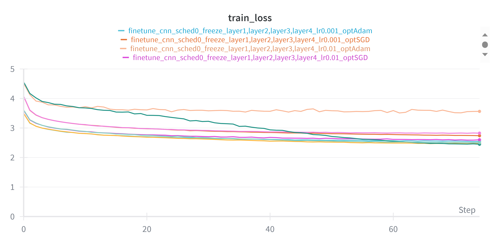  | 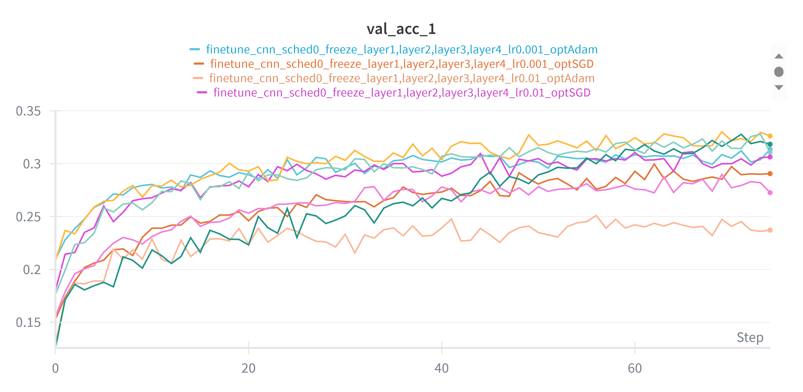  | 

- **Freeze layer1 + layer2**: Unfreezing layers 3 and 4 has a significant improvement, the best result is obtained with `SGD`, `lr=0.01`, reaching 55% test accuracy. 

- **Freeze only layer1**: Near full fine-tuning. This setup achieves the best overall results: 
  - Adam, lr=0.001 → 54.6% test accuracy, 81% top-5 accuracy.
  - SGD, lr=0.01 → 52.6% test accuracy. This is almost double the SVM baseline! 

-> Unexpectely best results come from freezing only few layers, freezing too much compromises adaptability.

| Validation Accuracy varying freezing strategies (fixed `lr=1e-3`, Adam optimizer)| 
|------------------------|
| 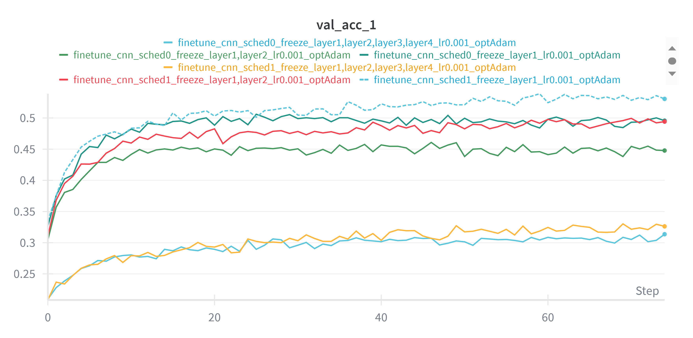  |

**Effect of the optimizer:** Adam outperforms SGD when only a few layers are unfrozen (layer1 or layer1+layer2) and the learning rate is low (0.001), reaching accuracies up to 54–55%, while SGD remains around 39–44%. With a higher learning rate (0.01) or more layers unfrozen, SGD can match or even surpass Adam, indicating that the choice of optimizer depends on the combination of unfrozen layers and learning rate. 
Also, the adding of the scheduler, consistently slightly improves Adam results (e.g, 52.5% → 54.6%), with SGD the difference is small. 

| Validation Accuracy varying freezing strategies and optimizer (fixed `lr=1e-3` for Adam and `lr=1e-2` for SGD)| 
|------------------------|
| 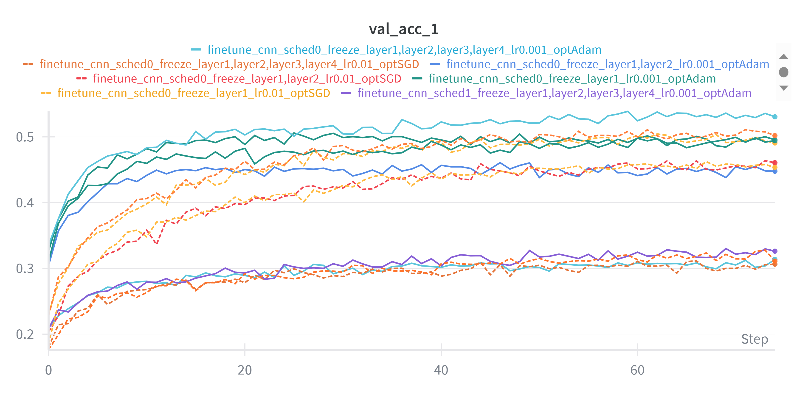  |


## Conclusions

Summary Table:
| Experiment        | Model                     | Dataset   | Config                  | Test Accuracy            |
| ----------------- | ------------------------- | --------- | ----------------------- | ------------------------ |
| **MLP**           | Plain MLP (40 layers)     | MNIST     | No residual             | **0.11–0.41** (collapse) |
| **ResMLP**        | ResMLP (40 layers)        | MNIST     | Residual + norm + sched | **98.3%**                |
| **CNN**           | CNN (2-2-2-2)             | CIFAR-10  | No skip                 | **74–76%**               |
| **CNN**           | CNN (3-4-6-3)             | CIFAR-10  | No skip                 | **59–70%**               |
| **CNN**           | CNN (5-6-8-5)             | CIFAR-10  | No skip                 | **27–41%** (collapse)    |
| **ResNet**        | CNN + residual            | CIFAR-10  | Skip + sched            | **77–78%**               |
| **ResNet + Augm** | CNN + residual            | CIFAR-10  | Skip + augm + sched     | **85%**                  |
| **Fine-tuning**   | ResNet-18 (pretrained)    | CIFAR-100 | SVM baseline            | **24.7%**                |
| **Fine-tuning**   | ResNet-18 (freeze all)    | CIFAR-100 | Linear eval             | **25–34%**               |
| **Fine-tuning**   | ResNet-18 (freeze l1+2)   | CIFAR-100 | SGD, lr=0.01            | **55%**                  |
| **Fine-tuning**   | ResNet-18 (freeze l1)     | CIFAR-100 | Adam, lr=0.001          | **54.6%**  |

**Key Observations**: Residuals make deep training possible, normalization and augmentation improve stability and generalization, and effective transfer learning requires selective fine-tuning with adaptive optimizers.

## References

- [Deep Residual Learning for Image Recognition.](https://arxiv.org/abs/1512.03385) — He et al., 2016
- [ResNet model implementation in Torchvision.](https://github.com/pytorch/vision/blob/main/torchvision/models/resnet.py#L204)


