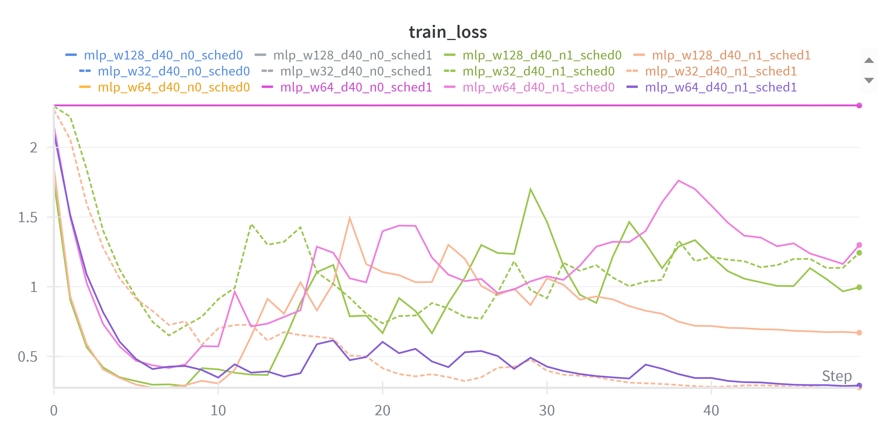
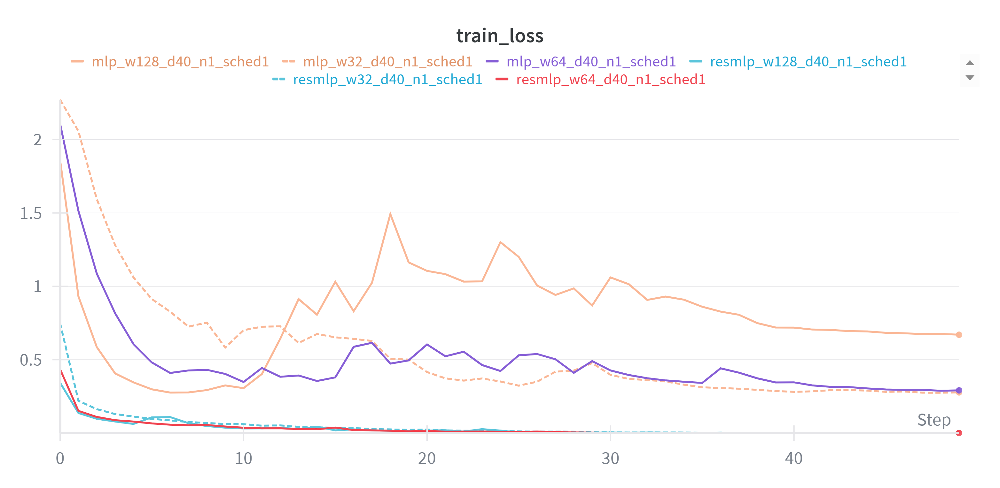
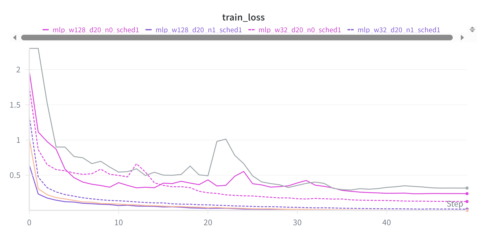
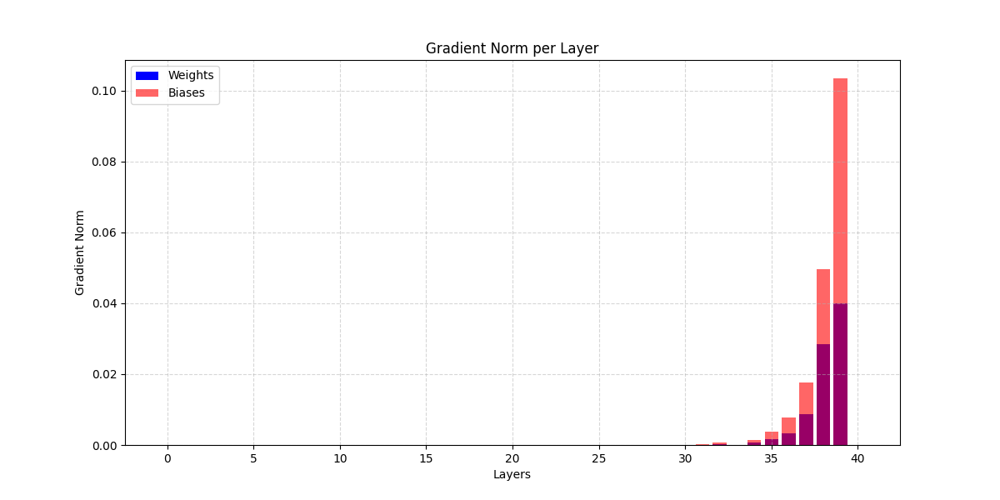
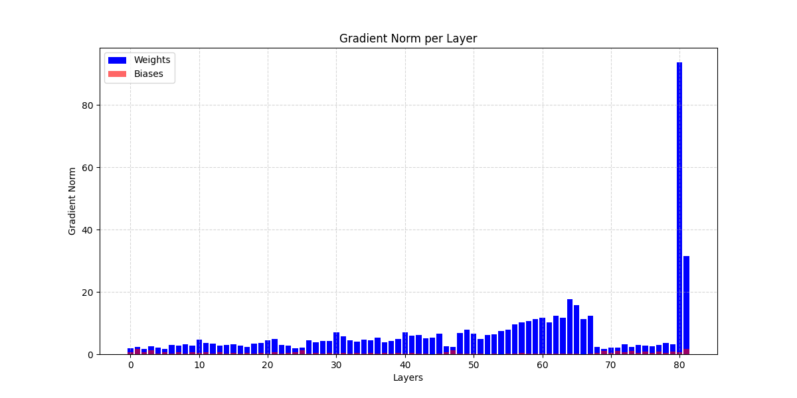

# Laboratory 1 - Deep Neural Networks: MLPs, ResMLPs, and CNNs

## Overview
This laboratory explores deep neural network architectures and their training dynamics, focusing on MLPs, Residual MLPs (ResMLPs), and CNNs trained on standard image classification datasets (MNIST, CIFAR-10, CIFAR-100). 

All experiments are tracked with Weights & Biases. You can find the complete logs and results here: [Lab_1 Results](https://wandb.ai/chiara-peppicelli-university-of-florence/DLA_Lab_1?nw=nwuserchiarapeppicelli).  

Main Objectives:

- Reproducing (at a smaller scale) results from the paper: [*Deep Residual Learning for Image Recognition*](https://arxiv.org/abs/1512.03385).
- Understanding the effect of residual connections on model performance.
- Investigating training dynamics and gradient flow.
- Exploring transfer learning through fine-tuning techniques.

### Project Structure

```
Lab_1/
├── main_ex1.py          # Main script for Exercise 1 (MLP/CNN experiments)
├── main_ex2.py          # Main script for Exercise 2 (Fine-tuning experiments)
├── models.py            # Model implementations (MLP, ResMLP, CNN)
├── dataloaders.py       # Data loading utilities for MNIST, CIFAR-10, CIFAR-100
├── train_eval.py        # Training and evaluation functions
├── utils.py             # Utility functions (gradient analysis, feature extraction)
├── run_experiments.sh   # Script to run all experiments
├── Models/              # Saved model weights
├── images/              # Folder containing figures/plots/results
└── README.md            # This file
```

### Implemented Models
1. **MLP (Multilayer Perceptron)**
- Configurable depth and width.
- Optional batch normalization.
- Standard feedforward architecture.
2. **ResMLP (Residual MLP)**
  - MLP with residual connections between blocks.
  - Each block contains two linear layers with skip connections.
  - Configurable depth and width.
  - Demonstrates residual learning benefits on MLPs.
3. **CNN (Convolutional Neural Network)**
  - ResNet-style architecture with BasicBlocks.
  - Configurable layer patterns: e.g. [2,2,2,2], [3,4,6,3], [5,6,8,5].
  - Optional residual connections for comparison.
  - Suitable for feature extraction and transfer learning.

### Datasets
- **MNIST**: 28×28 grayscale digit (10 classes).
- **CIFAR-10**: 32×32 color image (10 classes).
- **CIFAR-100**: 32×32 color image (100 classes).

### Requirements
All core dependencies are already listed in the main repository’s `requirements.txt`.

Alternatively, it's possible to install them manually: 
```bash 
pip install torch torchvision tqdm matplotlib scikit-learn wandb numpy
```
(Optional but recommended) Log in to Weights & Biases:
```bash
wandb login
```

**Run all experiments**:
It's possible to run all the experiments with the provided script:
```bash
chmod +x run_experiments.sh
./run_experiments.sh
```

## Exercise 1: Verification of ResNet findings on MLPs and CNNs
Train and evaluate MLPs and CNNs on MNIST/CIFAR-10 with varying depth, width, normalization, residual connections, and learning rate schedulers.

Run via command line using `main_ex1.py`.

#### Common Arguments
- `--epochs`: Number of training epochs (default: `50` for MLPs, `75` for CNNs).
- `--batch_size`: Batch size (default: `128`).
- `--lr`: Learning rate (default: `0.001`).
- `--num_workers`: Data loading workers (default: `4`).
- `--use_wandb`: Enable Weights & Biases logging.
- `--use_scheduler`: Use cosine annealing scheduler.

## MLP
Some examples on how to train and test the MLP/ResMLP models:

```bash
# Standard MLP on MNIST
python main_ex1.py --model mlp --dataset MNIST --depth 10 --width 128 --epochs 50

# ResMLP with residual connections
python main_ex1.py --model resmlp --dataset MNIST --depth 10 --width 128 --epochs 50

# With batch normalization and scheduler
python main_ex1.py --model resmlp --dataset MNIST --depth 20 --width 128 --normalization --use_scheduler --epochs 50
```
In addition to the common arguments presented above, the arguments specific to MLP and ResMLP are:

#### MLP/ResMLP Specific
- `--model`: Choose 'mlp' or 'resmlp'.
- `--hidden_size`: Only for 'mlp', provide a custom list of layer sizes.
- `--depth`: Number of hidden layers.
- `--width`: Number of neurons per layer
- `--normalization`: Enable batch normalization.

When using the MLP model (as opposed to ResMLP), there are two main ways to define its architecture:

- Custom architecture with `--hidden_sizes`: A list of integers can be provided to specify the size of each hidden layer. This allows experimentation with arbitrary layer configurations.

- Standard architecture with `--width` and `--depth`: This configuration enables a direct comparison with ResMLP, ensuring that both models have a comparable number of layers and units.

### Results
The first set of experiments involved applying MLP and ResMLP architectures to the MNIST dataset. I tested models with different depths (`10`, `20`, `40`) and widths (`32`, `64`, `128`), considering both the presence or absence of normalization and the use of a learning rate scheduler. This allowed me to evaluate the effect of residual connections and architectural configurations on training stability and performance.

#### MLP vs ResMLP on MNIST 


**Key observations**: 
1. **Depth without residual = total instability**: All MLPs without residual at `depth=40` collapse to ~0.11 test accuracy (see figure on the left below).
Even with normalization (n1), some attempt to converge but remain very low (e.g., mlp `width=128`, `depth=40`, `normalization`, `scheduler` ~0.41 acc).
→ Direct confirmation of the ResNet thesis: deeper ≠ better accuracy; in fact, clear degradation without skip connections.

2. **Residual connections save depth**: All resMLPs at depth=40 converge very well, for example `resmlp_w64_d40_n1_sched1` = 98.35% test acc vs `mlp_w64_d40_n1_sched1` = 88.7% (see figure on the right below).
→ Residuals keep training stable even in very deep architectures, unlike plain MLPs.

| All MLPs at `depth=40`, different parameters | ResMLP vs MLP (`depth=40`, `scheduler`,`normalization`) |
|--------------------------------------------|--------------------------------------------------------|
|  |  |

3. **Effect of width (w=32 → 64 → 128)**: At equal depth and with residual, increasing width gives small gains, for examples at depth 10 the test accuracy went from `97.77%` (`resmlp_w32_d10_n1_sched1`) to `98.59%` (`resmlp_w128_d10_n1_sched1`).

4. **Normalization (n1) is always useful**: For examples
- Without norm (`mlp_w32_d20_n0_sched1`) = `95.69%` accuracy.
- With norm (`mlp_w32_d20_n1_sched1`) = `97.41%` accuracy.
Residual + norm always pushes to the top (>98.5%).
→ Normalization mitigates instability, but alone is not enough for very deep nets (without residual they still collapse).

| Comparison of MLP models with and without normalization (depth=20, scheduler, various width)|
|--------------------------------------------|
|   | 

To better understand why residual connections improve training, I also analyzed the gradient flow in deep models.
I computed the gradient norms of each layer for a single minibatch.
In the plain 40-layer MLP, the gradient magnitudes vanish in the earliest layers, making training unstable and preventing learning.
In contrast, the residual MLP of the same depth shows stable gradient norms across layers, confirming that skip connections alleviate vanishing gradients and allow effective training of deep networks.

I ran MLP and ResMLP on MNIST with `depth=40` and `width=64` (no scheduler, no normalization). The table below shows the gradient norms:

| Gradient norm, model MLP | Gradient norm, model ResMLP| 
|--------------------------------------------|------------------------------------|
|   |   | 
| test accuracy 11.35% | test accuracy 96.65% | 


## CNN 
The CNN model is implemented using the BasicBlock definition from torchvision in [torchvision](https://github.com/pytorch/vision/blob/main/torchvision/models/resnet.py#L59).

Training can be performed with different configurations as shown below:

```bash
# CNN with residual connections (ResNet-18 style layers [2 2 2 2])
python main_ex1.py --model cnn --dataset CIFAR10 --layers 2 2 2 2 --use_residual --epochs 75

# CNN without residual connections
python main_ex1.py --model cnn --dataset CIFAR10 --layers 2 2 2 2 --epochs 75

# Deeper CNN (ResNet-34 style)
python main_ex1.py --model cnn --dataset CIFAR10 --layers 3 4 6 3 --use_residual --use_scheduler --epochs 75
```
In addition to the common arguments listed above, the CNN-specific arguments are:

#### CNN Specific
- `--model`: Must be set to 'cnn'.
- `--layers`: Layer pattern (e.g., 2 2 2 2 for ResNet-18).
- `--use_residual`: Enable residual (skip) connections.


#### CNN vs ResNet on CIFAR10


### Results 
The second set of experiments focused on CNNs applied to the CIFAR-10 dataset. I experimented with ResNet-style models of varying depths (ResNet-18, ResNet-34, and a deeper ResNet-50-like network), with and without residual connections, and with or without a learning rate scheduler. These experiments helped me understand how architectural depth and skip connections affect model performance.


## Exercise 2: Pre-trained model fine-tuning from CIFAR-10 to CIFAR-100


#### Fine-tuning Experiments

Path to the pre-trained model on CIFAR-10
In my case I used the models CNN ResNet-18 style, trained with data augmentation, skip connections and learning rate scheduler.

```bash
# Linear evaluation (freeze all layers)
python main_ex2.py --path Models/your_pretrained_model.pth --freeze_layers "layer1,layer2,layer3,layer4" --optimizer SGD --lr 1e-3 --epochs 75

# Fine-tuning (unfreeze last layers)
python main_ex2.py --path Models/your_pretrained_model.pth --freeze_layers "layer1,layer2" --optimizer Adam --lr 1e-3 --use_scheduler --epochs 75
```

#### Fine-tuning Specific
- `--path`: Path to pre-trained model
- `--freeze_layers`: Comma-separated layer names to freeze
- `--optimizer`: 'SGD' or 'Adam'


## Results
The final set of experiments was dedicated to fine-tuning pre-trained CNNs. I first conducted linear evaluation by freezing all layers to assess the quality of the learned representations. Then, I progressively unfreezed deeper layers for partial fine-tuning and left only the first layer frozen for almost full fine-tuning. These experiments allowed me to study the impact of different fine-tuning strategies on adaptation to the target dataset.


1. **Depth vs Performance**: Deeper networks without residual connections may perform worse
2. **Residual Benefits**: Networks with residual connections should train more effectively
3. **Gradient Flow**: Gradient analysis shows better flow in residual networks


1. **Feature Quality**: SVM baseline on extracted features
2. **Fine-tuning Strategies**: Comparison of different unfreezing strategies
3. **Optimizer Impact**: SGD vs Adam for fine-tuning tasks


## References

- [Deep Residual Learning for Image Recognition](https://arxiv.org/abs/1512.03385) — He et al., 201
- [](https://github.com/pytorch/vision/blob/main/torchvision/models/resnet.py#L204)


Key findings include:

- Residual connections significantly improve training stability and final accuracy, especially for deeper networks.
- Residual connections allow the gradients to backpropagate to earlier layers of the network with a stronger signal
- CNNs with skip connections demonstrate higher accuracy on CIFAR datasets. Moreover, CNNs with skip connections are less prone to overfitting.
- This trend is exxagerated when the depth of the convolutional network is increased.
- Class Activation Maps allow localization of discriminative image regions without additional supervision.


More material that supports those findings can be found inside the `wandb` project. 


