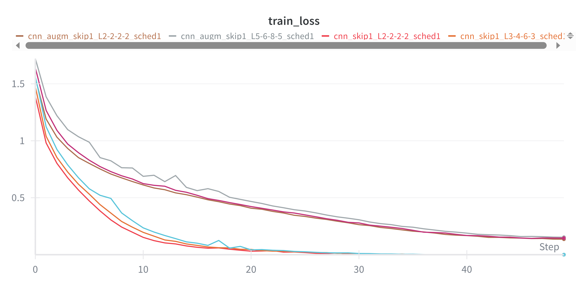

# Laboratory 1 - Deep Neural Networks: MLPs, ResMLPs, and CNNs

## Overview
This laboratory explores deep neural network architectures and their training dynamics, focusing on MLPs, Residual MLPs (ResMLPs), and CNNs trained on standard image classification datasets (MNIST, CIFAR-10, CIFAR-100). 

All experiments are tracked with Weights & Biases. You can find the complete logs and results here: [Lab_1 Results](https://wandb.ai/chiara-peppicelli-university-of-florence/DLA_Lab_1?nw=nwuserchiarapeppicelli).  

Main Objectives:

- Reproducing (at a smaller scale) results from the paper: [*Deep Residual Learning for Image Recognition*](https://arxiv.org/abs/1512.03385).
- Understanding the effect of residual connections on model performance.
- Investigating training dynamics and gradient flow.
- Exploring transfer learning through fine-tuning techniques.

### Project Structure

```
Lab_1/
├── main_ex1.py          # Main script for Exercise 1 (MLP/CNN experiments)
├── main_ex2.py          # Main script for Exercise 2 (Fine-tuning experiments)
├── models.py            # Model implementations (MLP, ResMLP, CNN)
├── dataloaders.py       # Data loading utilities for MNIST, CIFAR-10, CIFAR-100
├── train_eval.py        # Training and evaluation functions
├── utils.py             # Utility functions (gradient analysis, feature extraction)
├── run_experiments.sh   # Script to run all experiments
├── Models/              # Saved model weights
├── images/              # Folder containing figures/plots/results
└── README.md            # This file
```

### Implemented Models
1. **MLP (Multilayer Perceptron)**
  - Configurable depth and width.
  - Optional batch normalization.
  - Standard feedforward architecture.
2. **ResMLP (Residual MLP)**
  - MLP with residual connections between blocks.
  - Each block contains two linear layers with skip connections.
  - Configurable depth and width.
  - Demonstrates residual learning benefits on MLPs.
3. **CNN (Convolutional Neural Network)**
  - ResNet-style architecture with BasicBlocks.
  - Configurable layer patterns: e.g. [2,2,2,2], [3,4,6,3], [5,6,8,5].
  - Optional residual connections for comparison.
  - Suitable for feature extraction and transfer learning.

### Datasets
- **MNIST**: 28×28 grayscale digit (10 classes).
- **CIFAR-10**: 32×32 color image (10 classes).
- **CIFAR-100**: 32×32 color image (100 classes).

### Requirements
All core dependencies are already listed in the main repository’s `requirements.txt`.

Alternatively, it's possible to install them manually: 
```bash 
pip install torch torchvision tqdm matplotlib scikit-learn wandb numpy
```
(Optional but recommended) Log in to Weights & Biases:
```bash
wandb login
```

**Running Experiments**:
It's possible to run all the experiments with the provided script:
```bash
chmod +x run_experiments.sh
./run_experiments.sh
```

## Exercise 1: Verification of ResNet findings on MLPs and CNNs
Train and evaluate MLPs and CNNs on MNIST/CIFAR-10 with varying depth, width, normalization, residual connections, and learning rate schedulers.

Run via command line using `main_ex1.py`.

#### Common Arguments
- `--epochs`: Number of training epochs (default: `50` for MLPs, `75` for CNNs).
- `--batch_size`: Batch size (default: `128`).
- `--lr`: Learning rate (default: `0.001`).
- `--num_workers`: Data loading workers (default: `4`).
- `--use_wandb`: Enable Weights & Biases logging.
- `--use_scheduler`: Use cosine annealing scheduler.

## MLP
Some examples on how to train and test the MLP/ResMLP models:

```bash
# Standard MLP on MNIST
python main_ex1.py --model mlp --dataset MNIST --depth 10 --width 128 --epochs 50

# ResMLP with residual connections
python main_ex1.py --model resmlp --dataset MNIST --depth 10 --width 128 --epochs 50

# With batch normalization and scheduler
python main_ex1.py --model resmlp --dataset MNIST --depth 20 --width 128 --normalization --use_scheduler --epochs 50
```
In addition to the common arguments presented above, the arguments specific to MLP and ResMLP are:

#### MLP/ResMLP Specific
- `--model`: Choose 'mlp' or 'resmlp'.
- `--hidden_size`: Only for 'mlp', provide a custom list of layer sizes.
- `--depth`: Number of hidden layers.
- `--width`: Number of neurons per layer
- `--normalization`: Enable batch normalization.

When using the MLP model (as opposed to ResMLP), there are two main ways to define its architecture:

- Custom architecture with `--hidden_sizes`: A list of integers can be provided to specify the size of each hidden layer. This allows experimentation with arbitrary layer configurations.

- Standard architecture with `--width` and `--depth`: This configuration enables a direct comparison with ResMLP, ensuring that both models have a comparable number of layers and units.

### Results
The first set of experiments involved applying MLP and ResMLP architectures to the MNIST dataset. I tested models with different depths (`10`, `20`, `40`) and widths (`32`, `64`, `128`), considering both the presence or absence of normalization and the use of a learning rate scheduler. This allowed me to evaluate the effect of residual connections and architectural configurations on training stability and performance.

#### MLP vs ResMLP on MNIST 

**Key observations:** 
1. **Depth without residual = total instability**: All MLPs without residual at `depth=40` collapse to ~0.11 test accuracy (see figure on the left below).
Even with normalization (n1), some attempt to converge but remain very low (e.g., mlp `width=128`, `depth=40`, `normalization`, `scheduler` ~0.41 acc).
→ Direct confirmation of the ResNet thesis: deeper ≠ better accuracy; in fact, clear degradation without skip connections.

2. **Residual connections save depth**: All resMLPs at depth=40 converge very well, for example `resmlp_w64_d40_n1_sched1` = 98.35% test acc vs `mlp_w64_d40_n1_sched1` = 88.7% (see figure on the right below).
→ Residuals keep training stable even in very deep architectures, unlike plain MLPs.

| All MLPs at `depth=40`, different parameters | ResMLP vs MLP (`depth=40`, `scheduler`,`normalization`) |
|--------------------------------------------|--------------------------------------------------------|
|  |  |

3. **Effect of width (w=32 → 64 → 128)**: At equal depth and with residual, increasing width gives small gains, for examples at depth 10 the test accuracy went from `97.77%` (`resmlp_w32_d10_n1_sched1`) to `98.59%` (`resmlp_w128_d10_n1_sched1`).

4. **Normalization is always useful**: For examples
- Without norm (`mlp_w32_d20_n0_sched1`) = `95.69%` accuracy.
- With norm (`mlp_w32_d20_n1_sched1`) = `97.41%` accuracy.
Residual + norm always pushes to the top (>98.5%).
→ Normalization mitigates instability, but alone is not enough for very deep nets (without residual they still collapse).

| Comparison of Train Loss MLP models with and without normalization (depth=20, scheduler, various width)|
|--------------------------------------------|
|  | 

To better understand why residual connections improve training, I also analyzed the gradient flow in deep models.
I computed the gradient norms of each layer for a single minibatch.
In the plain 40-layer MLP, the gradient magnitudes vanish in the earliest layers, making training unstable and preventing learning.
In contrast, the residual MLP of the same depth shows stable gradient norms across layers, confirming that skip connections alleviate vanishing gradients and allow effective training of deep networks.

I ran MLP and ResMLP on MNIST with `depth=40` and `width=64` (no scheduler, no normalization). The table below shows the gradient norms:

| Gradient norm, model MLP | Gradient norm, model ResMLP| 
|--------------------------------------------|------------------------------------|
|   |   | 
| test accuracy 11.35% | test accuracy 96.65% | 


## CNN 
The CNN model is implemented using the BasicBlock definition from torchvision in [torchvision](https://github.com/pytorch/vision/blob/main/torchvision/models/resnet.py#L59).

Training can be performed with different configurations as shown below:

```bash
# CNN with residual connections (ResNet-18 style layers [2 2 2 2])
python main_ex1.py --model cnn --dataset CIFAR10 --layers 2 2 2 2 --use_residual --epochs 75

# CNN without residual connections
python main_ex1.py --model cnn --dataset CIFAR10 --layers 2 2 2 2 --epochs 75

# Deeper CNN (ResNet-34 style)
python main_ex1.py --model cnn --dataset CIFAR10 --layers 3 4 6 3 --use_residual --use_scheduler --epochs 75
```
In addition to the common arguments listed above, the CNN-specific arguments are:

#### CNN Specific
- `--model`: Must be set to 'cnn'.
- `--layers`: Layer pattern (e.g. 2 2 2 2 for ResNet-18).
- `--use_residual`: Enable residual (skip) connections.

### Results CNN vs ResNet on CIFAR10
The second set of experiments focused on CNNs applied to the **CIFAR-10** dataset. I experimented with ResNet-style models of varying depths (ResNet-18, ResNet-34, and a deeper ResNet-50-like network), with and without residual connections, and with or without a learning rate scheduler. These experiments helped me understand how architectural depth and skip connections affect model performance.

**Key observations:**

1. **With vs without skip connections**:
- Without skip:
Deep models collapse: `cnn_skip0_L5-6-8-5_sched0 = 41% acc`, sched1 even worse = 27% acc.
Medium architecture (L3-4-6-3) improves slightly but remains low (59–70%).
Only the smallest one (L2-2-2-2) reaches ~74–76%.
- With skip:
All models surpass **75–78%** accuracy. For examples `cnn_skip1_L3-4-6-3_sched1 = 77.9%` and `cnn_skip1_L2-2-2-2_sched1 = 77.9%`. Even the deepest model (L5-6-8-5), which collapsed without skip, reaches **77.8%** with skip.

-> For CNNs as well, residual connections stabilize training and enable deeper networks.

| Model                     | Test Accuracy |
|---------------------------|---------------|
| cnn_skip0_L2-2-2-2_sched1 | 0.7658        |                  
| cnn_skip0_L3-4-6-3_sched1 | 0.7069        | 
| cnn_skip0_L5-6-8-5_sched1 | *0.2747*      |                  
| cnn_skip1_L2-2-2-2_sched1 | 0.7795        |                  
| cnn_skip1_L3-4-6-3_sched1 | **0.7788**    |                  
| cnn_skip1_L5-6-8-5_sched1 | 0.7780        |                  
| Train Loss Curve |  |


2. **Effect of data augmentation (augm vs non-augm)**: I had good results, but I decided to introduce some data augmentations on the CIFAR10 dataset (all experiments without `augm` were run without augmentations). In particular I applied **random cropping** (`transforms.RandomCrop(32, padding=4)`) and **random horizontal flipping** (`transforms.RandomHorizontalFlip`). I found that these augmentations significantly improved the accuracy!
The three experiments with augmentations and skip connection achieve the higher test accuracy (**~85%**):
`cnn_augm_skip1_L5-6-8-5_sched1 = 85.3%`.
`cnn_augm_skip1_L3-4-6-3_sched1 = 85.4%`.
`cnn_augm_skip1_L2-2-2-2_sched1 = 85.0%`.
All clearly outperform models without augmentation (max ~78%).

-> Data augmentation provides a substantial boost in performance!

| Comparison of train loss between models with different layers configurations and on dataset augmentation or not   | Val Loss of models..| 
|--------------------------------------------|------------------------------------|
|   |   | 
| test accuracy 11.35% | test accuracy 96.65% | 


## Exercise 2: Pre-trained model fine-tuning from CIFAR-10 to CIFAR-100

For the second exercise I decided to do the finetuning on cifar100, since I had to do the fine tuning on one of the best performing models on cifar10, I used the models CNN ResNet-18 style, trained with data augmentation, skip connections and learning rate scheduler.

```bash
# Linear evaluation (freeze all layers)
python main_ex2.py --path Models/your_pretrained_model.pth --freeze_layers "layer1,layer2,layer3,layer4" --optimizer SGD --lr 1e-3 --epochs 75

# Fine-tuning (unfreeze last layers)
python main_ex2.py --path Models/your_pretrained_model.pth --freeze_layers "layer1,layer2" --optimizer Adam --lr 1e-3 --use_scheduler --epochs 75
```

#### Fine-tuning Specific
- `--path`: Path to pre-trained model
- `--freeze_layers`: Comma-separated layer names to freeze
- `--optimizer`: 'SGD' or 'Adam'


## Results
For the final experiments I first conducted linear evaluation by freezing all layers to assess the quality of the learned representations. Then, I progressively unfreezed deeper layers for partial fine-tuning and left only the first layer frozen for almost full fine-tuning. These experiments allowed me to study the impact of different fine-tuning strategies on adaptation to the target dataset.

1. Effect of freezing

Freeze layer1 (i.e., only the first block frozen, most blocks trainable)
→ Best performance: up to 54.6% test accuracy with Adam, lr=0.001, and scheduler active.
This shows that transfer from CIFAR-10 to CIFAR-100 works well if you reuse only low-level features (edges, textures) while allowing higher layers to adapt.

Freeze layer1 + layer2
→ Accuracy drops: max 50.1%. Adaptability decreases because too many intermediate convolutional layers are blocked (which encode mid-level features, crucial for distinguishing among 100 classes).

Freeze layer1+layer2+layer3+layer4 (i.e., fine-tuning only the classifier)
→ Sharp collapse: 25–34% accuracy. In practice, the model is used only as a feature extractor pretrained on CIFAR-10, but those features are not discriminative enough for CIFAR-100.

👉 Conclusion (freezing): Best results come from freezing only the first layers; freezing too much compromises adaptability.

2. Effect of the optimizer

Adam clearly outperforms SGD in all scenarios.
With Adam, accuracy always reaches 53–55%, while SGD struggles to go beyond ~48% even with scheduler.
With low learning rate, SGD even collapses to ~30–38%.

👉 Adam is better suited for this setup, likely because the combination of fine-tuning and the more complex dataset (CIFAR-100) requires faster parameter adaptation, which Adam handles better.

3. Effect of learning rate

For Adam, lr=0.001 works better than 0.01:

lr=0.01 → overfitting/instability (higher loss, lower accuracy).

lr=0.001 → lower loss, better accuracy.

For SGD, the opposite holds: lr=0.01 is better than 0.001 (but still worse than Adam).

With too low lr (0.001), SGD fails to converge.

👉 Optimal learning rate depends on optimizer: Adam → 0.001, SGD → 0.01.

4. Effect of scheduler

With Adam, the scheduler consistently improves results slightly (e.g., 52.5% → 54.6%).

With SGD, it sometimes worsens performance (e.g., freeze layer1, lr=0.01: 52.4% → 52.6% ≈ same accuracy, but higher train_loss).

👉 Conclusion: Scheduler is beneficial with Adam, negligible or even harmful with SGD.


## References

- [Deep Residual Learning for Image Recognition](https://arxiv.org/abs/1512.03385) — He et al., 201
- [](https://github.com/pytorch/vision/blob/main/torchvision/models/resnet.py#L204)


