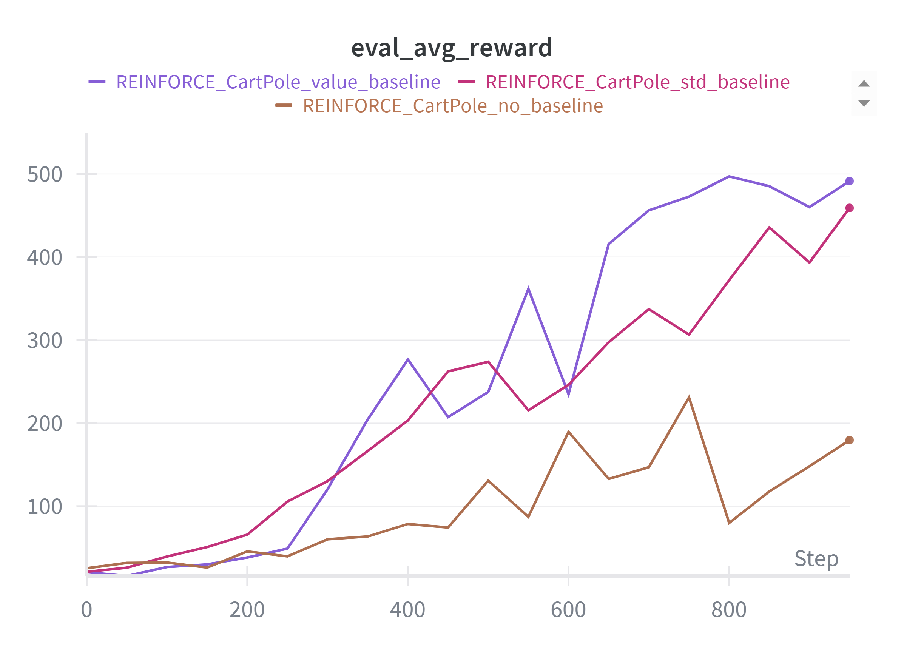
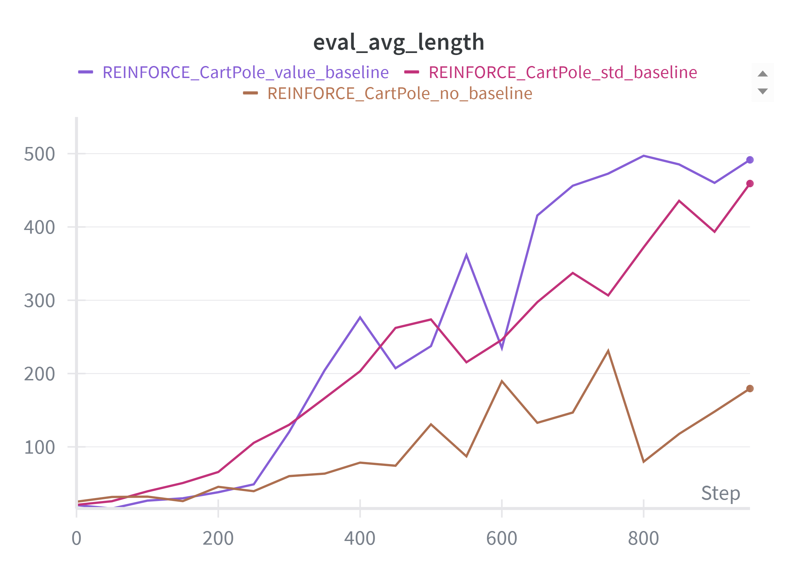
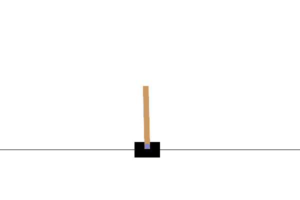

# Laboratory 2 — Deep Reinforcement Learning : REINFORCE on CartPole & LunarLander

## Overview
This lab implements the REINFORCE algorithm to train an agent in the **CartPole-v1** and **LunarLander-v3** environments using PyTorch. 
The implementations supports various enhancements including value baselines, entropy regularization, gradient clipping, and temperature scheduling.

All experiments are tracked with Weights & Biases. You can find the complete logs and results here: [Lab_2 Results](https://wandb.ai/chiara-peppicelli-university-of-florence/DLA_Lab_2?nw=nwuserchiarapeppicelli).  

Main objectives: 
- Implement REINFORCE on two environments: CartPole and LunarLander.
- Improve evaluation metrics by periodically testing the agent over multiple episodes and track average reward and episode length.
- Explore different baseline strategies for variance reduction.
- Analyze the impact of hyperparameters on training stability.

### Project Structure

```
├── main.py                # Entry point for training.
├── reinforce.py           # Core REINFORCE training loop.
├── networks.py            # Networks definitions (Policy and value).
├── utils.py               # Utility functions for training and evaluation.
├── save_gif.py            # Script to render a gif of a trained agent.
├── gif/                   # Folder containing saved gif.
├── images/                # Folder containing figures/plots/results.
├── run_experiments.sh     # Comprehensive experiment runner script
└── README.md              # This file.
```

**Networks**:
  - `PolicyNet`: Feedforward policy network for action selection.
  - `ValueNet`: Optional baseline network for advantage estimation.

### Requirements
All core dependencies are already listed in the main repository’s `requirements.txt`.

Alternatively, it's possible to install them manually: 
```bash 
pip install torch gymnasium wandb matplotlib pygame imageio 
```
Log in to Weights & Biases:
```bash
wandb login
```

### Running Experiments
All experiments are managed through a single script `main.py.` It is also possible to record a trained policy and save the interaction as a GIF, either in deterministic or stochastic mode, with adjustable temperature, using the script `save.py`.

```bash
# Train on CartPole with value baseline
python main.py --env cartpole --baseline value --episodes 1000

# LunarLander with all advanced techniques
python main.py --env lunarlander --baseline value --normalize --clip_grad --T 2.0 --t_schedule exponential --entropy_coeff 0.01 --episodes 2000

# Enable visualization of trained agent
python main.py --env cartpole --baseline std --episodes 500 --visualize

# Save a gif of best LunarLander trained agent 
python save_gif.py --env lunarlander --checkpoint wandb/run_id/files/checkpoint-best_eval_policy.pt  --det --gif_path landing_demo.gif
```

#### Arguments 
1. **Environment and Training:**
    - `--env`: Environment choice (`cartpole`, `lunarlander`).
    - `--episodes`: Number of training episodes (cartpole `1000`, lunarlander `2000`)
    - `--lr`: Learning rate (default: `1e-3`).
    - `--gamma`: Discount factor for future rewards (default: `0.99`).
2. **Baseline Configuration:**
    - `--baseline`: Baseline type (`none`, `std`, `value`).
    - `--normalize`: Normalize advantages (`G_t - b_t`) to zero mean and unit variance.
    - `--clip_grad`: Enable gradient clipping.
3. **Architecture:**
    - `--num_layers`: Number of hidden layers (default: `1`)
    - `--hidden_dim`: Hidden layer width (default: `128`).
4. **Exploration and Regularization:**
    - `--T`: Softmax temperature (default: `1.0`). If a temperature scheduler is used, this will be the starting temperature.
    - `--t_schedule`: Temperature scheduler (`linear`, `exponential`).
    - `--entropy_coeff:`: Entropy regularization coefficient (default: `0.01`).
5. **Evaluation:**
    - `--eval_interval`: Evaluate every N episodes (default: `50`).
    - `--eval_episodes`: Number of episodes for evaluation (default: `20`).
    - `--det`: Enable deterministic policy evaluation every `--eval-interval` iterations.
6. **Logging and Visualization:**
    - `--visualize`: Show trained agent in action.
    - `--run_name`: Wandb run name. If None, a name will be automatically generated.

7. **Saving GIF (`save_gif.py`):** accepts some of the arguments as `main.py`, because it need to reconstruct the network and environment exactly as in training (`--env`,`--T`,`--det`, `--num_layers`, `--hidden_dim`). In addition, it uses:
    - `--episodes`: Number of full environment episodes to run and record in the GIF.
    - `--make_gif`: Create GIF of a trained agent.
    - `--gif_path`: Path to save the gif.   
    - `--checkpoint`: Path to the checkpoint (default: best agent of the last run, `wandb/latest-run/files/checkpoint-best_eval_policy.pt`).

## Cartpole-v1 Experiments

**Key observations:**
1. **Effect of the Baseline**:
- **No baseline**: Performance is significantly worse. Average episode length stalls at ~100–200 steps. Rewards are unstable, and policy loss is very high (20–30), leading to noisy learning.
- **Standard deviation baseline** (std baseline): Improvement compared to none, but still unstable, some runs remain low while others converge well. Average reward sometimes stays below 400.
- **Value baseline**: Clearly the most stable. Many runs reach near-maximal rewards (~500 per episode). Even when varying hyperparameters (γ, entropy, T, architectures), convergence is robust.

-> Using a value baseline drastically reduces the variance of REINFORCE and ensures stable convergence!


| Average reward of different baselines  | Average length of the episode, different baselines |
|---------------|----------------|
|  |  |


2. **Core Hyperparameters:**
- The sweet spot for the discount factor (`gamma`) is 0.95–0.99, too lower (0.90) or too higher (0.999) disrupts training.
- Low temperatures (`T`) cause policy collapse. Scheduling enhances initial exploration and improves convergence.

3. **Architecture & Regularization:**
- Larger networks help only if baseline is stable otherwise, they worsen instability.
- Gradient clipping & normalization help control variance and stabilize training, especially with a value baseline!

| Different types of regularization. | Gamma comparison.  | Architecture comparison.  |
|---------------|----------------|---------------|
|  |  |  |


4. **Stochastic and Deterministic Average Evaluation Rewards**

| Stochastic evaluation | Deterministic evaluation  |
|---------------|----------------|
|  |  |

### Qualitative Results

<table>
  <tr>
    <th>Cartpole no baseline.</th>
    <th>Value scheduler.</th>
  </tr>
  <tr>
    <td></td>
    <td></td>
  </tr>
</table>

## LunarLander-v3 Experiments

**Key observations:**
1. **Effect of the Baseline**:
- No baseline: Very low and unstable performance. Average episodic reward often negative (e.g., -1070). Policy loss is high → training is nearly impossible.
- Std baseline: Slight stabilization, but still noisy; average reward improves but remains inconsistent.
- Value baseline: Clearly the best. Average episodic reward is often positive and consistent. Some runs reach ~700–750 in eval_avg_reward.

-> As with CartPole, using a value baseline is essential for REINFORCE on LunarLander.
2.  **Core Hyperparameters:**
- Too low γ loses long-term reward information; too high γ makes training unstable. Optimal γ ~ 0.95–0.99 (similar to CartPole but it's even more sensitive).
- On LunarLander, slightly lower LR than CartPole helps stability, especially with gradient clipping and normalization. Default lr = 1e-3 works reasonably well but slighty lower lr = 5e-4 with normalization + gradient clipping has a more stable training, on the other side too high lr makes the policy loss explode.
- Runs with normalize + clip_grad hase better stabilization: higher average rewards, less noisy policy loss!
- Here, differently from Cartpole, changing the entropy coefficient provide slightly changes, entropy = 0.01–0.05 maintains exploration (with optimal around 0.01), an higher coefficient provide no significant advantage.

3. **Number of episodes:**
- I also tried to experiment with longer episodes (5000) and I found out that
- 1000 episodes: sometimes unstable, depending on other hyperparameters.
4. **Stochastic and Deterministic Average Evaluation Rewards**

### Qualitative Results


- LunarLander is a more challenging environment, and this is reflected in the reward curves: Initial rewards are highly negative, and the learning process shows significant variance across different runs
- I managed to achieve a peak average evaluation reward of approx `277` (violet curve) by training an agent with REINFORCE for `7000` episodes, using gradient clipping, advantage normalization, exponential temperature scheduling (with a starting temperature of `2`), entropy regularization and a deeper and wider network with respect to our baseline (`width = 256` instead of `128`, `depth = 2` instead of `1`)
- For more complex tasks like LunarLander, REINFORCE exhibits higher variance and greater sensitivity to hyperparameters. Achieving good performance is possible but not guaranteed, often requiring careful tuning and potentially many trials. The results highlight the challenges of applying vanilla REINFORCE to harder problems without more advanced techniques for variance reduction or exploration. 

## Conclusions

## References

- [Williams, R. J. (1992). Simple statistical gradient-following algorithms for connectionist reinforcement learning.](https://link.springer.com/article/10.1007/BF00992696) Machine learning, 8(3-4), 229-256
- [Greensmith, E., Bartlett, P. L., & Baxter, J. (2004). Variance reduction techniques for gradient estimates in reinforcement learning.](https://www.jmlr.org/papers/volume5/greensmith04a/greensmith04a.pdf) Journal of Machine Learning Research, 5(Nov), 1471-1530
- Some useful code([compute_returns]).(https://www.geeksforgeeks.org/machine-learning/reinforce-algorithm/)
https://gymnasium.farama.org/environments/classic_control/cart_pole/
