# Laboratory 2 — Deep Reinforcement Learning : REINFORCE on CartPole & LunarLander

## Overview
This lab implements the REINFORCE algorithm to train an agent in the **CartPole-v1** and **LunarLander-v3** environments using PyTorch. 
The implementations supports various enhancements including value baselines, entropy regularization, gradient clipping, and temperature scheduling.

All experiments are tracked with Weights & Biases. You can find the complete logs and results here: [Lab_2 Results](https://wandb.ai/chiara-peppicelli-university-of-florence/DLA_Lab_2?nw=nwuserchiarapeppicelli).  

Main objectives: 
- Implement REINFORCE on two environments: CartPole and LunarLander.
- Periodically testing the agent over multiple episodes and track average reward and episode length.
- Explore different baseline strategies for variance reduction.
- Analyze the impact of hyperparameters on training stability.

### Project Structure

```
├── main.py                # Entry point for training.
├── reinforce.py           # Core REINFORCE training loop.
├── networks.py            # Networks definitions (Policy and value).
├── utils.py               # Utility functions for training and evaluation.
├── save_gif.py            # Script to render a gif of a trained agent.
├── gif/                   # Folder containing saved gif.
├── images/                # Folder containing figures/plots/results.
├── run_experiments.sh     # Comprehensive experiment runner script.
└── README.md              # This file.
```

**Networks**:
  - `PolicyNet`: A feedforward network that outputs action probabilities.
  - `ValueNet`: An optional network serving as a baseline for advantage calculation.

### Requirements
All core dependencies are already listed in the main repository’s `requirements.txt`.

Alternatively, it's possible to install them manually: 
```bash 
pip install torch gymnasium wandb matplotlib pygame imageio 
```
Log in to Weights & Biases:
```bash
wandb login
```

### Running Experiments
All experiments are managed through a single script `main.py.` It is also possible to record a trained agent acting inside the environment as a GIF, either in deterministic or stochastic mode, with adjustable temperature, using the script `save.py`.

```bash
# Train on CartPole with value baseline
python main.py --env cartpole --baseline value --episodes 1000

# LunarLander with all advanced techniques
python main.py --env lunarlander --baseline value --normalize --clip_grad --T 2.0 --t_schedule exponential --entropy_coeff 0.01 --episodes 2000

# Enable visualization of trained agent
python main.py --env cartpole --baseline std --episodes 500 --visualize

# Save a gif of best LunarLander trained agent 
python save_gif.py --env lunarlander --checkpoint wandb/run_id/files/checkpoint-best_eval_policy.pt  --det --gif_path landing_demo.gif
```

#### Arguments 
1. **Environment and Training:**
    - `--env`: Environment choice (`cartpole`, `lunarlander`).
    - `--episodes`: Number of training episodes (cartpole `1000`, lunarlander `2000`)
    - `--lr`: Learning rate (default: `1e-3`).
    - `--gamma`: Discount factor for future rewards (default: `0.99`).
2. **Baseline Configuration:**
    - `--baseline`: Baseline type (`none`, `std`, `value`).
    - `--normalize`: Normalize advantages (`G_t - b_t`) to zero mean and unit variance.
    - `--clip_grad`: Enable gradient clipping.
3. **Architecture:**
    - `--num_layers`: Number of hidden layers (default: `1`)
    - `--hidden_dim`: Hidden layer width (default: `128`).
4. **Exploration and Regularization:**
    - `--T`: Softmax temperature (default: `1.0`). If a temperature scheduler is used, this will be the starting temperature.
    - `--t_schedule`: Temperature scheduler (`linear`, `exponential`).
    - `--entropy_coeff:`: Entropy regularization coefficient (default: `0.01`).
5. **Evaluation:**
    - `--eval_interval`: Evaluate every N episodes (default: `50`).
    - `--eval_episodes`: Number of episodes for evaluation (default: `20`).
    - `--det`: Enable deterministic policy evaluation every `--eval-interval` iterations.
6. **Logging and Visualization:**
    - `--visualize`: Show trained agent in action.
    - `--run_name`: Wandb run name. If None, a name will be automatically generated.

7. **Saving GIF (`save_gif.py`):** accepts some of the arguments as `main.py`, because it need to reconstruct the network as in training (`--env`,`--T`,`--det`, `--num_layers`, `--hidden_dim`). In addition, it uses:
    - `--episodes`: Number of full environment episodes to run and record in the GIF.
    - `--gif_path`: Path to save the gif.   
    - `--checkpoint`: Path to the checkpoint (default: best agent of the last run, `wandb/latest-run/files/checkpoint-best_eval_policy.pt`).

## Cartpole-v1 Experiments

**Key observations:**
1. **Effect of the Baseline**:
- **No baseline**: Performance is significantly worse. Average episode length stalls at ~100–200 steps. Rewards are unstable, and policy loss is very high (20–30), leading to noisy learning.
- **Standard deviation baseline** (std baseline): Improvement compared to none, but still unstable, some runs remain low while others converge well! Average reward sometimes stays below 400.
- **Value baseline**: Many runs reach near-maximal rewards (~500 per episode). Even when varying hyperparameters (gamma, entropy, T, architectures), convergence is robust.

**Stochastic and Deterministic Average Evaluation Rewards**

| Stochastic evaluation | Deterministic evaluation  |
|---------------|----------------|
| 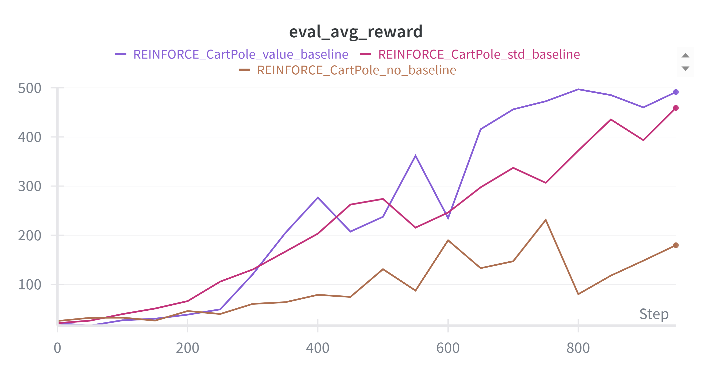 | 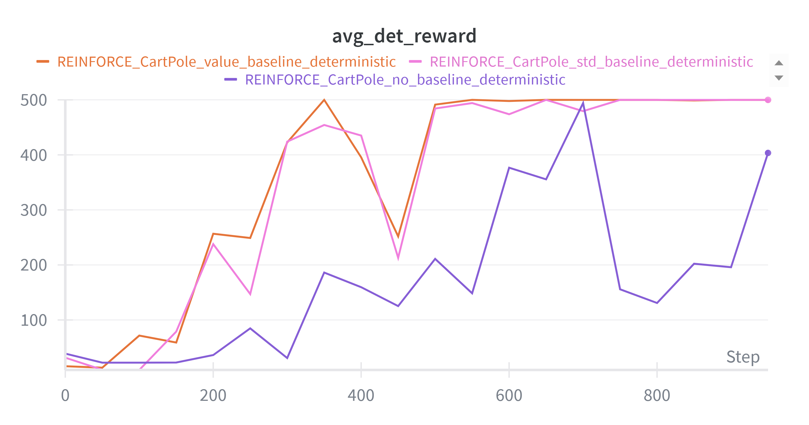 |

2. **Core Hyperparameters:**
- The sweet spot for the discount factor (`gamma`) is 0.95–0.99, too lower (0.90) or too higher (0.999) disrupts training.
- The value baseline ensures stable learning, by adding an exponential scheduling and by using a lower T (0.5) I noticed a quicker convergence.

3. **Architecture & Regularization:**
- Larger networks help only if baseline is stable otherwise, they worsen instability.
- Gradient clipping & normalization help control variance and stabilize training, especially with a value baseline!

| Different types of regularization | Architecture comparison | Gamma comparison |
|----------------------------------|--------------------------|------------------|
| 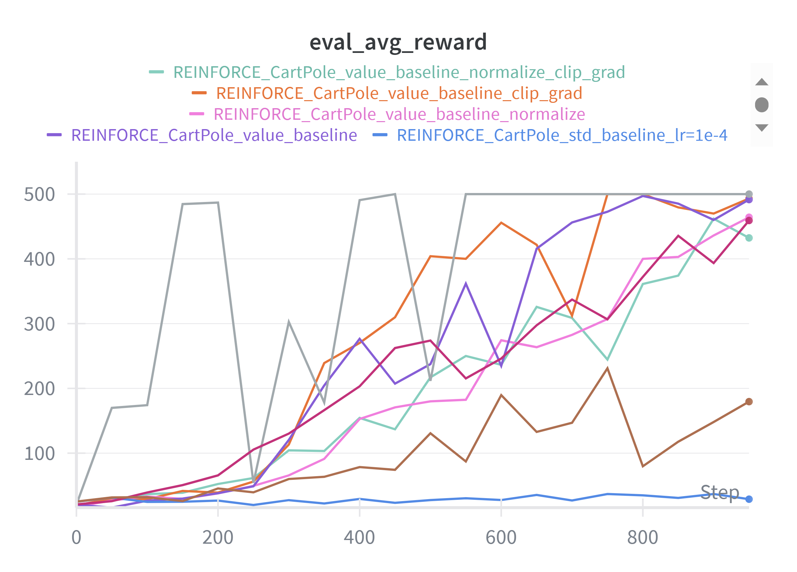 | 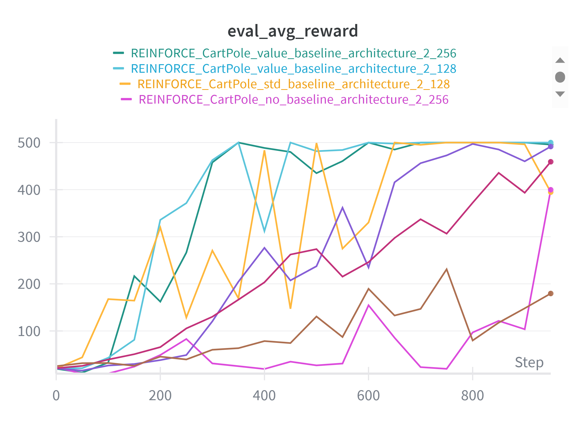 | 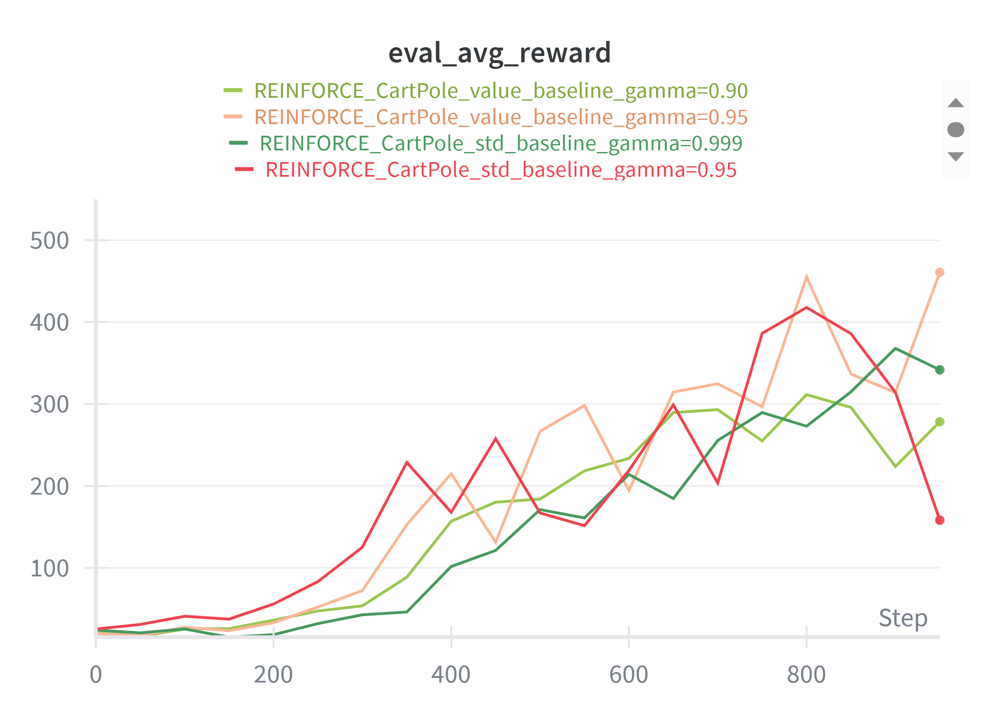 |

### Qualitative Results

| Cartpole no baseline. | Cartpole with value baseline + exponential scheduler.  |
|---------------|----------------|
| 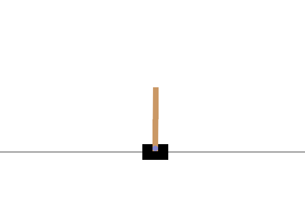 |  |

## LunarLander-v3 Experiments

**Key observations:**
1. **Effect of the Baseline**:
- **No baseline**: Very low and unstable performance. Average episodic reward often negative (e.g. -71.20). Training is noisy and unpredictable.
- **Std baseline**: Slight stabilization, average reward improves (up to 32.60) and episodes are longer (~798–1000).
- **Value baseline**: Average reward varies widely depending on the configuration. The run's average rewards range from -33.77 to 59.92, with the highest obtained by adding normalization and gradient clipping. I also experimented with longer episodes (5000 steps) and found that they yield more stable performance(`eval_avg_reward` up to ~206).

-> As with CartPole, using a value baseline is essential for REINFORCE on LunarLande, particularly when combined with normalization, gradient clipping, and sufficient training length.

**Stochastic and Deterministic Average Evaluation**

| Stochastic average reward of different baselines | Stochastic average length of the episodes, different baselines |
|---------------|----------------|
| 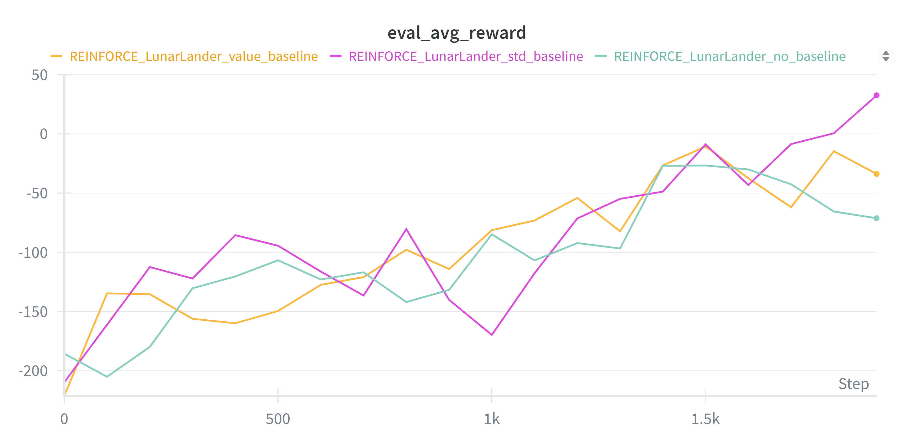 | 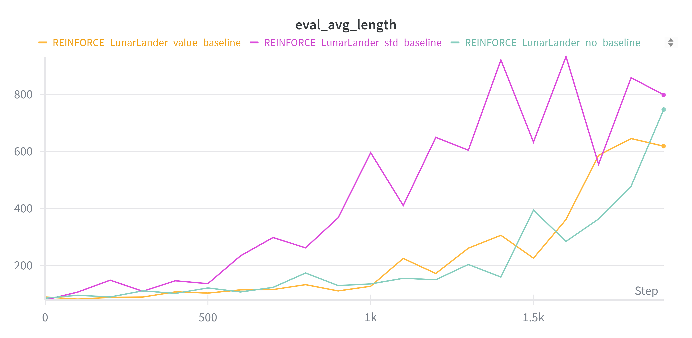 |

| Deterministic average rewards | Deterministic average length  |
|---------------|----------------|
| 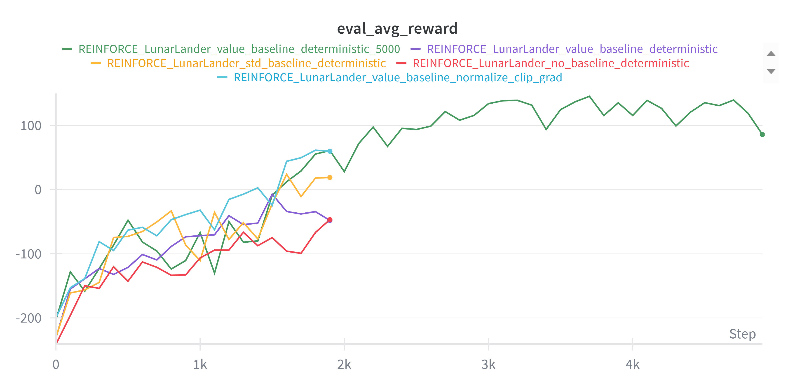 | 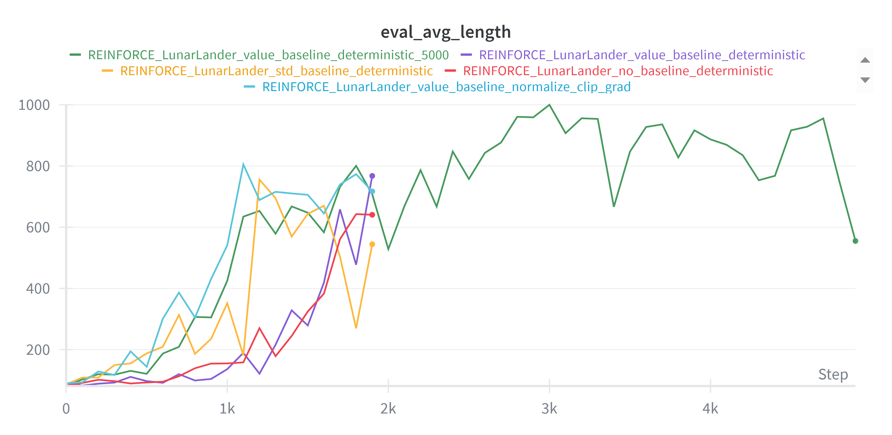 |


2.  **Core Hyperparameters:**
- Too low `gamma` loses long term reward information while too high `gamma` makes training unstable. Optimal is in the range 0.95–0.99 (similar to CartPole).
- Lower `lr = 5e-4` + normalization + clipping reach a small avg reward -64.70 (too low for stability). Default `lr = 1e-3` with normalization + gradient clipping has a more stable training and reach the highest average reward.

| Different types of regularization | Gamma comparison  |
|---------------|----------------|
| 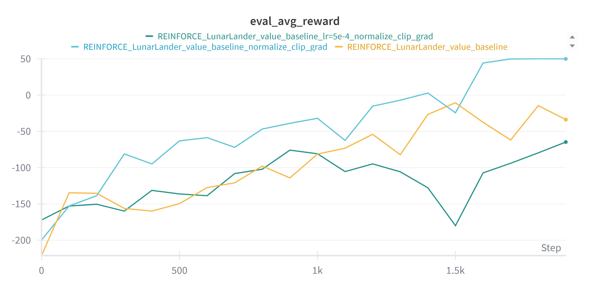 | 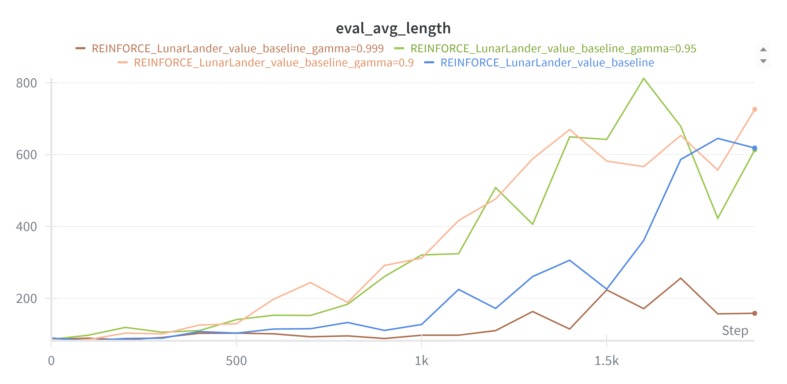 | 


### Qualitative Results

| Lunarlander no baseline | Lunarlander with value baseline (5000 episodes and regularizations) |
|---------------|----------------|
| 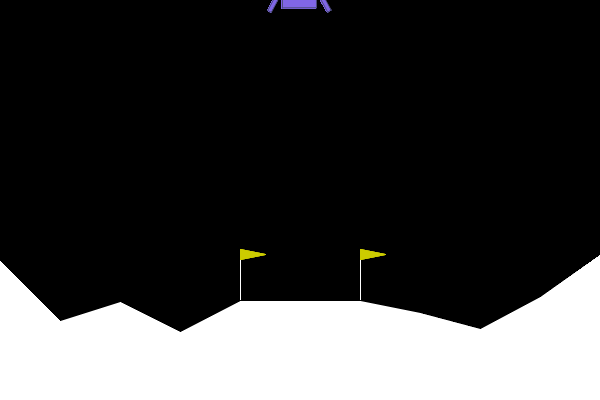 | 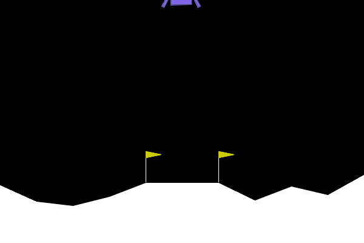 |


## Conclusions
- REINFORCE works well on CartPole and LunarLander, but LunarLander is a more challenging  environment due to higher variance and negative initial rewards.
- Using a value baseline, advantage normalization, and gradient clipping greatly stabilizes training. Also a proper tuning of learning rate, discount factor, entropy, and network size can help for convergence and high rewards.

## References

- [Williams, R. J. (1992). Simple statistical gradient-following algorithms for connectionist reinforcement learning.](https://link.springer.com/article/10.1007/BF00992696) Machine learning, 8(3-4), 229-256.
- Some code reference, e.g. [compute_returns.](https://www.geeksforgeeks.org/machine-learning/reinforce-algorithm/)
- [CartPole-v1 documentation.](https://gymnasium.farama.org/environments/classic_control/cart_pole/)
- [LunarLander-v3 documentation.](https://gymnasium.farama.org/environments/box2d/lunar_lander/)

