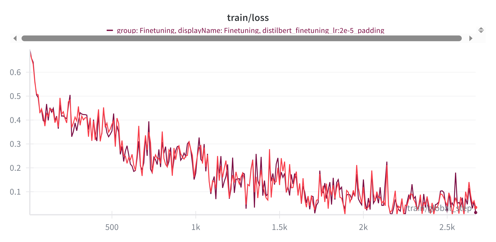
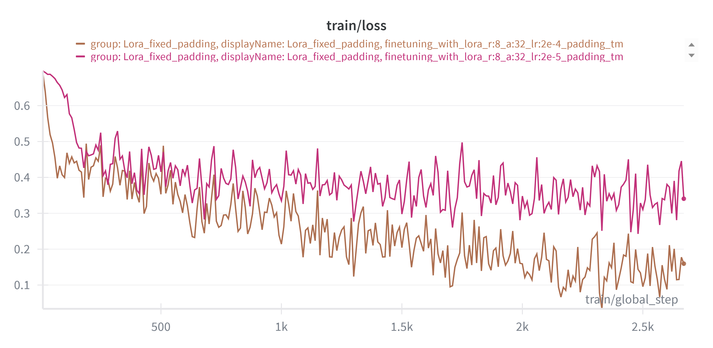
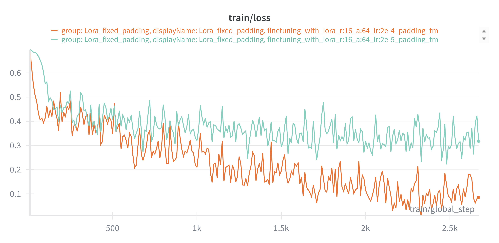

# Laboratory 3 - Working with Transformers in the HuggingFace Ecosystem

## Overview

This laboratory explores the HuggingFace ecosystem for adapting pre-trained transformer models to downstream tasks. The lab focuses on sentiment analysis on the *"rotten_tomatoes"* dataset using **DistilBERT** as the backbone model.

All experiments are tracked with Weights & Biases. You can find the complete logs and results here: [Lab_3 Results](https://wandb.ai/chiara-peppicelli-university-of-florence/DLA_Lab_3?nw=nwuserchiarapeppicelli).  

Main objectives:

- Explore the dataset and probe pre-trained models.
- Build a stable baseline using DistilBERT embeddings with a linear classifier.
- Tokenize the dataset and fine-tune DistilBERT using HuggingFace `Trainer`.
- Apply parameter-efficient fine-tuning with LoRA (Low-Rank Adaptation).

### Project Structure
```
Lab_3/
├── main.py                    # Main entry point with argument parsing.
├── exercise1.py               # Dataset exploration and SVM baseline.
├── exercise2.py               # Full model fine-tuning with Trainer.
├── exercise3.py               # Parameter-efficient fine-tuning with LoRA.
├── utils.py                   # Configuration and utility functions.
├── run_experiments.sh         # Comprehensive experiment runner script.
├── check_parameters.sh        # Script to compute trainable and total parameters for the main models.
├── images/                    # Folder containing figures/plots/results.
└── README.md                  # This file.
```

### Requirements
All core dependencies are already listed in the main repository’s `requirements.txt`.

Alternatively, it's possible to install them manually: 
```bash 
pip install torch transformers datasets scikit-learn numpy tqdm wandb peft
```
(Optional but recommended) Log in to Weights & Biases:
```bash
wandb login
```
### Running Experiments

All experiments are managed through a single script `main.py.` The `--step` argument selects the exercise to run.

```bash
# Exercise 1
# Inspect dataset and explore pre-trained model (Exercise 1.1 and 1.2)
python main.py --step e11
python main.py --step e12

# Run SVM baseline (Exercise 1.3) (optional wandb log)
python main.py --step e13 

# Tokenize dataset for fine-tuning (Exercise 2.1)
python main.py --step e21 

# Fine-tune DistilBERT with Trainer (Exercise 2.2 and 2.3)
python main.py --step e23 $ARGS_finetuning

# Fine-tune DistilBERT using LoRA (Exercise 3.1)
python main.py --step e31 $ARGS_finetuning_LORA
```
### Arguments 

1. **Exercise 1.2: Model and tokenizer exploration**
    - `--sample_text`: Optional input text(s) for testing the tokenizer.

2. **Finetuning hyperparameters**
    - `--lr`: Learning rate for fine-tuning (default: `2e-5`).
    - `--epochs`: Number of training epochs (default: `5`).
    - `--batch_size`: Training batch size (default: `16`).
    - `--use_fixed_padding`: Use fixed padding to `max_length=512`, if it's not passed, by default, padding is dynamic.

3. **LoRA parameters**
    - `--lora_alpha`: LoRA alpha (default: `32`).
    - `--lora_rank`: LoRA rank (default: `8`).
    - `--target_modules`: Target modules to apply LoRA. Examples: `q_lin, k_lin, v_lin, out_lin` / `q_lin, k_lin, v_lin, out_lin lin1 lin2`.

4. **Output and logging**
    - `--output_dir`: Directory for saving models and logs.
    - `--use_wandb`: Enable Weights & Biases logging.
    - `--run_name`: Name of the WandB run (optional). Some default run names are already defined in the code, but you can provide a custom name if desired.

### Finetuning Experiment Suite
It's possible to run all the main finetuning experiments with the provided script:
```bash
chmod +x run_experiments.sh
./run_experiments.sh
```

# Experiments and Results

## Exercise 1: Dataset and Model Exploration
In this exercise, I explored the _Rotten Tomatoes_ dataset and the pre-trained DistilBERT model (see `exercise1.py`). 

**Key observations:**
1. **Dataset structure and splits**:
    - The dataset contains **5,331** positive and **5,331** negative sentences (balanced across splits).
    - Standard splits (train (8530 samples), validation (1066), test (1066)) were available.

2. **Tokenizer and sample exploration**:
    - Sample sentences were used to understand tokenizer behavior. It correctly splits text into subword tokens and adds special tokens `[CLS]` (ID `101`) at the start of the sentence and `[SEP]` (ID `102`) at the end. 
    - The `[CLS]` token embedding represents the full sentence and can be used for downstream tasks.
    - Padding and truncation are used to handle different text lengths, ensuring a consistent size for batch processing.
    - DistilBERT outputs hidden states of size `768` for each token.

3. **SVM baseline**:
    - The pre trained `DistilBERT` model was used as a feature extractor. 
    - `CLS` token embeddings were extracted from the training, validation and test sets.
    - A **Linear SVM classifier** trained on these features provides a simple baseline for sentiment classification.
    - Metrics (accuracy, precision, recall, F1) give an initial reference point before fine-tuning the transformer.

**SVM Results:**      
| Split      | Accuracy | Precision | Recall | F1 Score |
| ---------- | -------- | --------- | ------ | -------- |
| **Validation** | 0.8180   | 0.8317    | 0.7974 | 0.8142   |
| **Test**       | 0.7946   | 0.8054    | 0.7767 | 0.7908   |


## Exercise 2: Tokenization, Model Setup, and Fine-tuning
This exercise prepared the Rotten Tomatoes dataset for fine-tuning a DistilBERT model for binary sentiment classification (see `exercise2.py` script).

#### **Dataset Tokenization**:
The `tokenize_dataset` function returns a HuggingFace `DatasetDict` with tokenized splits (train, validation, test). Each split contains the **original text** and **label** plus: 
- `input_ids` → numerical token IDs. 
- `attention_mask` → indicating which tokens are real and which are padding.

Tokenization uses a `tokenize_function` that processes batches of examples and applies the pretrained tokenizer (`AutoTokenizer.from_pretrained('distilbert/distilbert-base-uncased')`) with truncation enabled to limit sequences to a maximum length, and *optional padding*.

#### **Padding options**:
The HuggingFace tokenizer supports multiple padding strategies, controlled by the `padding` argument (`bool`, `str` or `PaddingStrategy`, default `False`):

- `False` (default): No padding is applied during tokenization. Sequences keep their natural lengths (after truncation to `max_length` if specified) and padding is applied dynamically at training time by `DataCollatorWithPadding`, which pads each batch to the length of the longest sequence it contains. This approach is more efficient because short sequences are not unnecessarily padded to a global maximum, leading to less wasted computation and memory.

- `max_length` (fixed padding, enabled when `use_fixed_padding=True`) : Every example is padded to the fixed `max_length` (`512` tokens for DistilBERT) and truncated if longer. This produces uniform batch shapes, which can simplify debugging and visualization and can be useful on older hardware or frameworks that require fixed-size tensors. However, this strategy is computationally heavier, as a result, training is slower and requires more memory compared to dynamic padding.

**Runtime Comparison: Dynamic vs Fixed Padding**
I evaluated both padding strategies for fine-tuning DistilBERT on the Rotten Tomatoes dataset (batch size = 16, epochs = 5, learning rate = 2e-5) on an NVIDIA GeForce RTX 4060 Ti, the results show a substantial speed advantage for dynamic padding:

| Setup                      | Train Runtime | Samples/sec | Steps/sec |
| -------------------------- | ------------- | ----------- | --------- |
| Dynamic Padding            | 103.6s        | 412         | 25.8      |
| Fixed Padding (512 tokens) | 781.5s        | 54.6        | 3.4       |

For the fine-tuning of DistilBERT with LoRA (rank=8, alpha=32), the difference is even more pronounced:

| Setup                      | Train Runtime | Samples/sec | Steps/sec |
| -------------------------- | ------------- | ----------- | --------- |
| Dynamic Padding            | 58.8s         | 726         | 45.4      |
| Fixed Padding (512 tokens) | 709.2s        | 60          | 3.8       |

**Observation**: Dynamic padding is roughly ~7-12× faster than fixed padding on the same hardware.

**Figures:** 

| DistilBERT comparison padding fixed vs dynamics. | DistilBERT+ Lora comparison padding fixed vs dynamics |
|---------------|----------------|
|  |  |
| In blue dynamic padding, in orange fixed padding.| 

These results confirm that dynamic padding provides a substantial speed advantage without compromising accuracy, making it the preferred strategy on modern GPUs.

## Fine-tuning Distilbert
For fine-tuning the DistilBERT model for binary sequence classification, I used Hugging Face's `Trainer` API. 
It supports configurable learning rate, number of epochs, batch size, and padding strategy (dynamic or fixed). 

The experiments were conducted using a **batch size** of **16** and **5 epochs**, as transformer models like DistilBERT typically converge quickly on downstream tasks such as sentiment classification, with most performance gains occurring within the first few epochs.

The study focused on comparing two different learning rates (`2e-4` and `2e-5`) to assess their impact on training stability and overall model performance.

| Padding      | Learning Rate | Test Accuracy | Test F1 | Test Precision | Test Recall |
| ------------ | ------------- | ------------- | ------- | -------------- | ----------- |
| `max_length` | 2e-4          | 0.8002        | 0.7802  | 0.8670         | 0.7092      |
| `max_length` | 2e-5          | 0.8424        | 0.8439  | 0.8361         | 0.8518      |
| False        | 2e-4          | 0.8049        | 0.8023  | 0.8131         | 0.7917      |
| False        | 2e-5          | **0.8537**        | **0.8564**  | **0.8409**         | **0.8724**      |

**Key observations:**

- Using a learning rate of (`2e-5`) resulted in a lower training loss (~0.19), indicating stable and effective learning. On the other hand using higher learning rate (`2e-4`) led to a higher training loss (~0.22) and reduced recall, suggesting that excessive learning rates can destabilize training and harm generalization on small datasets.

- Overall the best performance was achieved with `2e-5`, regardless of padding, delivering the highest F1 score, recall, and balanced precision.

**Figures:** 
|Train Loss over Steps: Learning Rate Comparison| Padding Strategy Comparison|
|---------------|----------------|
| |  |
| In blue `lr=2e-4`, in red `lr=2e-5`.       | Same fine-tuning parameters except different padding. |                               

-> There is almost no difference in using either padding strategies except on the runtime!

## Exercise 3: Efficient Fine-tuning with LoRA
LoRA was applied with configurable rank, alpha, and target modules. Experiments varied padding, learning rate, and module selection (see `exercise3.py`).

| Learning Rate | Module Target | LoRA (r, a) | Test Accuracy | Test F1 | Test Precision | Test Recall | 
| ------------- | ------------- | ----------- | ------------- | ------- | -------------- | ----------- | 
| 2e-4          | Attention           | (16, 64)    | 0.8349        | 0.8391  | 0.8182         | 0.8612      | 
| 2e-4          | Attention           | (8, 32)     | 0.8321        | 0.8353  | 0.8195         | 0.8518      |
| 2e-5          | Attention          | (16, 64)    | 0.8368        | 0.8395  | 0.8258         | 0.8537      |
| 2e-5          | Attention          | (8, 32)     | 0.8302        | 0.8316  | 0.8247         | 0.8386      | 
| 2e-4          | Attention + FFN     | (16, 64)    | 0.8377        | 0.8385  | 0.8346         | 0.8424      | 
| 2e-4          | Attention + FFN     | (8, 32)     | **0.8443**        | **0.8460**  | **0.8367**         | **0.8555**      | 
| 2e-5          | Attention + FFN     | (16, 64)    | 0.8311        | 0.8311  | 0.8311         | 0.8311      | 
| 2e-5          | Attention + FFN      | (8, 32)     | 0.8265        | 0.8260  | 0.8283         | 0.8236      |

-> `Attention + FFN = q_lin k_lin v_lin out_lin lin1 lin2`
-> `Attention = q_lin k_lin v_lin out_lin` 


**Key observations:**
- LoRA achieves strong performance while training only a small fraction of the parameters.
- For Attention only modules, changing the learning rate between `2e-4` and `2e-5` has minimal impact on metrics.
- Expanding the target modules to Attention + FFN (`q_lin, k_lin, v_lin, out_lin, lin1, lin2`) shows little improvements especially when combined with `lr=2e-4`. The best results are obtained with `lr=2e-4`, Attention + FFN, `r=8/α=32`, reaching Test `Accuracy 0.8443` and `F1 0.8460`.
- Lower learning rates (`2e-5`) on Attention + FFN lead to marginally lower metrics.
- Higher LoRA rank/alpha (`16,64`) does not consistently outperform smaller rank/alpha (`8,32`), so the optimal configuration balances module target, learning rate, and rank rather than relying solely on parameter count.

**Figures:**
|Train Loss over Steps: Learning Rate Comparison (`2e-4` and `2e-5`) (`rank=8`, `alpha=32`, Attention+FFN) | Train Loss over Steps: Learning Rate Comparison (`2e-4` and `2e-5`)(`rank=16`, `alpha=64`, Attention+FFN)|
|---------------|----------------|
| |  |

                              
|Training loss for LoRA DistilBERT. Different lines = different r/α and lr settings.|
|----------------|
||

All training was done with a `batch_size=16` and `epochs=5`.

## Conclusions

| Approach                                     | Trainable Params \* | Test Accuracy | Test F1 | Test Precision | Test Recall |
| -------------------------------------------- | ---------------- | ------------- | ------- | -------------- | ----------- |
| Baseline SVM                                 | 1.538k           | 0.7946        | 0.7908  | 0.8054         | 0.7767      |
| Full Fine-tuning DistilBERT                  | 66.955M          | 0.8537        | 0.8564  | 0.8409         | 0.8724      |
| LoRA DistilBERT (r=8, α=32, Attention + FFN) | 1.255M           | 0.8443        | 0.8460  | 0.8367         | 0.8555      |

(\* see `check_parameters.py`)

**Key Observations**:
- The SVM is extremely lightweight (~1.5k parameters) and provides a stable baseline.
- Full fine-tuning of DistilBERT uses all ~66M parameters, achieving the best performance across all metrics.
- LoRA adapts only ~1.25M parameters (~2% of the total), achieving performance very close to full fine-tuning.

This confirms the advantage of LoRA in terms of computational and memory efficiency without major compromises in accuracy, F1, or other test metrics.

## Resources

- [HuggingFace Transformers Documentation.](https://huggingface.co/docs/transformers/)
- [Feature Extraction Task.](https://huggingface.co/tasks/feature-extraction)
- [Trainer API.](https://huggingface.co/docs/transformers/main/en/main_classes/trainer)
- [PEFT Library Guide.](https://huggingface.co/docs/peft/)
- [LoRA Paper.](https://arxiv.org/abs/2106.09685)
- [DistilBERT Paper.](https://arxiv.org/abs/1910.01108)