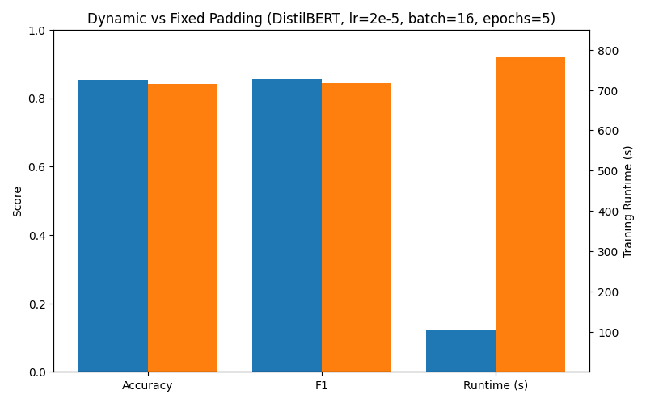

# Laboratory 3 - Working with Transformers in the HuggingFace Ecosystem

## Overview

This laboratory explores the HuggingFace ecosystem for adapting pre-trained transformer models to downstream tasks. The lab focuses on sentiment analysis on the *"rotten_tomatoes"* dataset using **DistilBERT** as the backbone model.

Main objectives:

- Explore the dataset and probe pre-trained models.
- Build a stable baseline using DistilBERT embeddings with a linear classifier.
- Tokenize the dataset and fine-tune DistilBERT using HuggingFace `Trainer`.
- Apply parameter-efficient fine-tuning with LoRA (Low-Rank Adaptation).

### Project Structure
```
Lab_3/
├── main.py                    # Main entry point with argument parsing
├── exercise1.py               # Dataset exploration and SVM baseline
├── exercise2.py               # Full model fine-tuning with Trainer
├── exercise3.py               # Parameter-efficient fine-tuning with LoRA
├── utils.py                   # Configuration and utility functions
├── run_experiments.sh         # Comprehensive experiment runner script
└── README.md                  # This file
```

### Requirements
All core dependencies are already listed in the main repository’s `requirements.txt`.

Alternatively, it's possible to install them manually: 
```bash 
pip install torch transformers datasets scikit-learn numpy tqdm wandb peft
```
(Optional but recommended) Log in to Weights & Biases:
```bash
wandb login
```
## Running Experiments

All experiments are managed through a single script `main.py.` The `--step` argument selects the exercise to run.

```bash
# Exercise 1
# Inspect dataset and explore pre-trained model (Exercise 1.1 and 1.2)
python main.py --step e11
python main.py --step e12

# Run SVM baseline (Exercise 1.3) (optional wandb log)
python main.py --step e13 

# Tokenize dataset for fine-tuning (Exercise 2.1)
python main.py --step e21 

# Fine-tune DistilBERT with Trainer (Exercise 2.3)
python main.py --step e23 $ARGS_finetuning

# Fine-tune DistilBERT using LoRA (Exercise 3.1)
python main.py --step e31 $ARGS_finetuning_LORA
```
### Arguments 

1. **Exercise 1.2: Model and tokenizer exploration**
    - `--sample_text`: Optional input text(s) for testing the tokenizer.

2. **Finetuning hyperparameters**
    - `--lr`: Learning rate for fine-tuning (default: `2e-5`).
    - `--epochs`: Number of training epochs (default: `5`).
    - `--batch_size`: Training batch size (default: `16`).
    - `--use_fixed_padding`: Use fixed padding to `max_length=512`, if it's not passed, by default, padding is dynamic.

3. **LoRA parameters**
    - `--lora_alpha`: LoRA alpha (default: `32`).
    - `--lora_rank`: LoRA rank (default: `8`).
    - `--target_modules`: Target modules to apply LoRA. Examples: `q_lin, k_lin, v_lin, out_lin` / `q_lin, k_lin, v_lin, out_lin lin1 lin2`.

4. **Output and logging**
    - `--output_dir`: Directory for saving models and logs.
    - `--use_wandb`: Enable Weights & Biases logging.
    - `--run_name`: Name of the WandB run (optional). Some default run names are already defined in the code, but you can provide a custom name if desired.

### Finetuning Experiment Suite
It's possible to run all the main finetuning experiments with the provided script:
```bash
chmod +x run_experiments.sh
./run_experiments.sh
```

## Experiments and Results

### Exercise 1: Dataset and Model Exploration
In this exercise, I explored the _Rotten Tomatoes_ dataset and the pre-trained DistilBERT model (see `exercise1.py`). 

**Key observations:**
1. **Dataset structure and splits**:
    - The dataset contains **5,331** positive and **5,331** negative sentences (balanced across splits).
    - Standard splits (train (8530 samples), validation (1066), test (1066)) were available.

2. **Tokenizer and sample exploration**:
    - Sample sentences were used to understand tokenizer behavior. It correctly splits text into subword tokens and adds special tokens `[CLS]` (ID `101`) at the start of the sentence and `[SEP]` (ID `102`) at the end. 
    - The [CLS] token embedding represents the full sentence and can be used for downstream tasks.
    - Padding and truncation are used to handle different text lengths, ensuring a consistent size for batch processing.
    - DistilBERT outputs hidden states of size `768` for each token.

3. **SVM baseline**:
    - The pre trained `DistilBERT` model was used as a feature extractor. 
    - `CLS` token embeddings were extracted from the training and validation sets.
    - A **Linear SVM classifier** trained on these features provides a simple but stable baseline for sentiment classification.
    - Metrics (accuracy, precision, recall, F1) give an initial reference point before fine-tuning the transformer.
    - SVM Results: 
    | Split      | Accuracy | Precision | Recall | F1 Score |
    | ---------- | -------- | --------- | ------ | -------- |
    | Validation | 0.8180   | 0.8317    | 0.7974 | 0.8142   |
    | Test       | 0.7946   | 0.8054    | 0.7767 | 0.7908   |


### Exercise 2: Tokenization, Model Setup, and Fine-tuning
This exercise prepared the Rotten Tomatoes dataset for fine-tuning a DistilBERT model for binary sentiment classification (see `exercise2.py` script).

#### **Dataset Tokenization**:
The `tokenize_dataset` function returns a HuggingFace `DatasetDict` with tokenized splits (train, validation, test). Each split contains the **original text** and **label** plus: 
    - `input_ids` → numerical token IDs. 
    - `attention_mask` → indicating which tokens are real and which are padding.

Tokenization uses a `tokenize_function` that processes batches of examples and applies the pretrained tokenizer (`AutoTokenizer.from_pretrained('distilbert/distilbert-base-uncased')`) with truncation enabled to limit sequences to a maximum length, and *optional padding*.

#### **Padding options**:
The HuggingFace tokenizer supports multiple padding strategies, controlled by the `padding` argument (`bool`, `str` or `PaddingStrategy`, default `False`):

- `False` (default): No padding is applied during tokenization. Sequences retain their natural lengths (after truncation to `max_length` if specified). During training, `DataCollatorWithPadding` dynamically pads each batch to the length of the longest sequence in that batch.

- Trade-offs: Batch shapes vary at runtime. This is generally fine (and typical) on CPU/GPU training.

Advantages:
    - Efficiency: Reduces wasted computation and memory because short sequences are not padded to a global maximum length.
    - Flexibility: Handles variable-length sequences naturally.

Trade-offs:
    - Batch shapes vary at runtime, which can slightly complicate logging or debugging.
    - Minimal overhead on modern GPU training, such as on an NVIDIA GeForce RTX 4060 Ti, which can easily handle dynamic shapes.

- `max_length` (fixed padding, enabled when `use_fixed_padding=True`) : Every example is padded to the fixed `max_length` (`512` tokens for DistilBERT) and truncated if longer.

Advantages:
    - Uniform batch shapes simplify debugging and model export (e.g., ONNX or TorchScript).
    - Some frameworks or older GPUs may require fixed-size tensors.

Trade-offs:
    - Increased computation and memory usage, as shorter sequences are padded up to the global maximum.
    - Slower training compared to dynamic padding, especially for smaller batches or shorter sequences.

Speed & memory: Dynamic batch padding is typically faster and lighter.

Shape uniformity: Fixed padding yields constant shapes at the cost of extra compute/memory.

Caching: Padding done at tokenization time is baked into the saved dataset; dynamic padding is applied on the fly per training batch.

#### Runtime Comparison: Dynamic vs Fixed Padding
I evaluated both padding strategies for fine-tuning DistilBERT on the Rotten Tomatoes dataset (batch size = 16, epochs = 5, learning rate = 2e-5) on an NVIDIA GeForce RTX 4060 Ti, the results show a substantial speed advantage for dynamic padding:

| Setup                      | Train Runtime | Samples/sec | Steps/sec |
| -------------------------- | ------------- | ----------- | --------- |
| Dynamic Padding            | 103.6s        | 412         | 25.8      |
| Fixed Padding (512 tokens) | 781.5s        | 54.6        | 3.4       |

For the fine-tuning of DistilBERT with LoRA (rank=8, alpha=32), the difference is even more pronounced:

| Setup                      | Train Runtime | Samples/sec | Steps/sec |
| -------------------------- | ------------- | ----------- | --------- |
| Dynamic Padding            | 58.8s         | 726         | 45.4      |
| Fixed Padding (512 tokens) | 709.2s        | 60          | 3.8       |

**Observation**: Dynamic padding is roughly ~7-12× faster than fixed padding on the same hardware.

**Figures:**
| DistilBERT comparison padding fixed vs dynamics. | DistilBERT+ Lora comparison padding fixed vs dynamics |
|---------------|----------------|
|  |  |


These results confirm that dynamic padding provides a substantial speed advantage without compromising accuracy, making it the preferred strategy on modern GPUs.

### Fine-tuning Distilbert
For fine-tuning the DistilBERT model for binary sequence classification, I used Hugging Face's `Trainer` API. 
It supports configurable learning rate, number of epochs, batch size, and padding strategy (dynamic or fixed). 

The experiments were conducted using a **batch size** of **16** and **5 epochs**, as transformer models like DistilBERT typically converge quickly on downstream tasks such as sentiment classification, with most performance gains occurring within the first few epochs.

The experiments included a comparison of two different learning rates to evaluate their effect on training stability and model performance.

**Key observations:**
- With a learning rate of `2e-5`, the model achieved a lower training loss (~0.19), indicating stable and accurate learning.
- With a learning rate of `2e-4`, the loss remained higher (~0.22), suggesting that a too high learning rate causes oscillations and reduces the model's generalization capability.
- No significant differences were observe between dynamic padding and fixed padding to 512 tokens, performance remained comparable, but fixed padding led to longer runtimes (more tokens processed on average).


### Exercise 3: Efficient Fine-tuning with LoR
LoRA was applied with configurable rank, alpha, and target modules. Experiments varied padding, learning rate, and module selection (see `exercise3.py`).

**Key observations:**
- LoRA achieved competitive results compared to full fine-tuning with lower computational cost.
- With a learning rate of `2e-5`, rank=8/α=32 and rank=16/α=64, the training loss stayed low (~0.22–0.25) and test metrics were good.
- With a learning rate of `2e-4`, performance degraded: the loss remained higher and test/validation metrics dropped, as also observed in full fine-tuning.
- Extending target modules (`q_lin, k_lin, v_lin, out_lin, lin1, lin2`) did not provide substantial advantages over only tuning attention layers. This suggests that localized adaptation on attention blocks is sufficient to capture the necessary task information.

### Results Comparison

| Method | Parameters Trained | Training Time | Validation Acc | Test Acc |
|--------|-------------------|---------------|----------------|----------|
| SVM Baseline | ~1M (SVM only) | 2-5 minutes | ~82% | ~79% |
| Full Fine-tuning | ~67M (all) | 15-30 minutes | ~88% | ~85% |
| LoRA Fine-tuning | ~0.3M (adapters) | 5-10 minutes | ~87% | ~84% |


### Summary of Trends
- Learning rate 2e-5 is optimal for both full fine-tuning and LoRA.
- Fixed padding increases runtime without improving performance.
- LoRA maintains comparable performance to full fine-tuning while reducing computational cost, confirming its effectiveness for efficient Transformer adaptation.

## Resources

- [HuggingFace Transformers Documentation](https://huggingface.co/docs/transformers/)
- [Feature Extraction Task](https://huggingface.co/tasks/feature-extraction)
- [Trainer API](https://huggingface.co/docs/transformers/main/en/main_classes/trainer)
- [PEFT Library Guide](https://huggingface.co/docs/peft/)
- [LoRA Paper](https://arxiv.org/abs/2106.09685)
- [DistilBERT Paper](https://arxiv.org/abs/1910.01108)